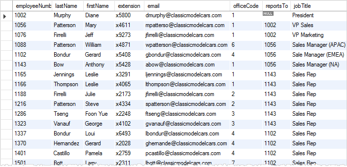

# Giới thiệu câu lệnh SELECT

Câu lệnh `SELECT` là câu lệnh dùng để truy vấn dữ liệu từ một hoặc nhiều bảng trong cơ sở dữ liệu. Ví dụ:

```sql
SELECT * FROM employees;
```



- Câu lệnh trên sẽ trả về tất cả các dòng và cột từ bảng `employees`.
- Dấu ; ở cuối câu lệnh là dấu kết thúc câu lệnh SQL. Khi viết nhiều câu lệnh SQL trong cùng một file, mỗi câu lệnh phải kết thúc bằng dấu ;. SQL sẽ thực thi từng câu lệnh một.
- Dấu \* trong câu lệnh `SELECT * FROM employees;` có nghĩa là chọn tất cả các cột từ bảng `employees`. Nếu muốn chọn một số cột cụ thể, thay \* bằng tên cột cần chọn, cách nhau bởi dấu phẩy. Ví dụ:

```sql
SELECT first_name, last_name FROM employees;
```

- SELECT và FROM có thể viết hoa hoặc thường, không ảnh hưởng gì cả.

# Giới thiệu câu lệnh ORDER BY

Câu lệnh `ORDER BY` được sử dụng để sắp xếp kết quả truy vấn theo một hoặc nhiều cột. Ví dụ:

```sql
SELECT * FROM employees ORDER BY first_name;
```

- Câu lệnh trên sẽ trả về tất cả các dòng và cột từ bảng `employees`, được sắp xếp theo cột `first_name`. Mặc định, sắp xếp theo cột đó sẽ là sắp xếp tăng dần (ASC). Để sắp xếp giảm dần, thêm từ khóa `DESC` vào sau tên cột. Ví dụ:

```sql
SELECT * FROM employees ORDER BY first_name DESC;
```

- ORDER BY có thể sử dụng với một hoặc nhiều cột. Ví dụ:

```sql
SELECT * FROM employees ORDER BY first_name, last_name;
```

- Câu lệnh trên sẽ trả về tất cả các dòng và cột từ bảng `employees`, được sắp xếp theo cột `first_name` tăng dần, sau đó sắp xếp theo cột `last_name` tăng dần. Để sắp xếp giảm dần theo cột `last_name`, thêm từ khóa `DESC` vào sau tên cột. Ví dụ:

```sql
SELECT * FROM employees ORDER BY first_name ASC, last_name DESC;
```

# Giới thiệu về các câu lệnh Filtering Data

## Câu lệnh WHERE

Câu lệnh `WHERE` được sử dụng để lọc dữ liệu trả về từ một câu lệnh `SELECT`. Ví dụ:

```sql
SELECT * FROM employees WHERE first_name = 'John';
```

- Câu lệnh trên sẽ trả về tất cả các dòng và cột từ bảng `employees` mà cột `first_name` có giá trị là `John`. Các toán tử so sánh thường được sử dụng trong câu lệnh `WHERE` bao gồm: `=`, `!=`, `>`, `<`, `>=`, `<=`. Ví dụ:

```sql
SELECT * FROM employees WHERE salary > 50000;
```

- Câu lệnh trên sẽ trả về tất cả các dòng và cột từ bảng `employees` mà cột `salary` có giá trị lớn hơn `50000`.

- Ngoài ra có thể sử dụng các toán tử logic `AND`, `OR`, `NOT`, `LIKE`,  để kết hợp nhiều điều kiện trong câu lệnh `WHERE`. Ví dụ:

```sql
SELECT * FROM employees WHERE first_name = 'John' AND salary > 50000;
```

- Câu lệnh trên sẽ trả về tất cả các dòng và cột từ bảng `employees` mà cột `first_name` có giá trị là `John` và cột `salary` có giá trị lớn hơn `50000`.

## Câu lệnh DISTINCT

Câu lệnh `DISTINCT` được sử dụng để loại bỏ các dòng trùng lặp từ kết quả truy vấn. Ví dụ:

```sql
SELECT DISTINCT first_name FROM employees;
```

- Câu lệnh trên sẽ trả về tất cả các giá trị duy nhất từ cột `first_name` trong bảng `employees`. Câu lệnh `DISTINCT` có thể sử dụng với một hoặc nhiều cột. Ví dụ:

```sql
SELECT DISTINCT first_name, last_name FROM employees;
```

- Câu lệnh trên sẽ trả về tất cả các cặp giá trị duy nhất từ cột `first_name` và `last_name` trong bảng `employees`. Câu lệnh `DISTINCT` không thể sử dụng với các hàm như `COUNT`, `SUM`, `AVG`, `MAX`, `MIN`. Nếu muốn sử dụng `DISTINCT` với các hàm này, hãy sử dụng câu lệnh con.

## Câu lệnh BETWEEN

Câu lệnh `BETWEEN` được sử dụng để lọc dữ liệu trong một phạm vi giá trị. Ví dụ:

```sql
SELECT * FROM employees WHERE salary BETWEEN 50000 AND 100000;
```

- Câu lệnh trên sẽ trả về tất cả các dòng và cột từ bảng `employees` mà cột `salary` có giá trị nằm trong khoảng từ `50000` đến `100000`. Câu lệnh `BETWEEN` cũng có thể sử dụng với các kiểu dữ liệu khác như `DATE`, `DATETIME`, `TIMESTAMP`.

## Câu lệnh IN, NOT IN, LIKE, LIMIT

- Câu lệnh `IN` được sử dụng để lọc dữ liệu từ một tập hợp các giá trị. Ví dụ:

```sql
SELECT * FROM employees WHERE department_id IN (1, 2, 3);
```

- Câu lệnh trên sẽ trả về tất cả các dòng và cột từ bảng `employees` mà cột `department_id` có giá trị là `1`, `2` hoặc `3`. Câu lệnh `NOT IN` sẽ trả về tất cả các dòng và cột từ bảng `employees` mà cột `department_id` không có giá trị là `1`, `2` hoặc `3`.

- Câu lệnh `LIKE` được sử dụng để lọc dữ liệu từ một cột dựa trên một mẫu chuỗi. Ví dụ:

```sql
SELECT * FROM employees WHERE first_name LIKE 'J%';
```

- Câu lệnh trên sẽ trả về tất cả các dòng và cột từ bảng `employees` mà cột `first_name` bắt đầu bằng chữ cái `J`. Dấu `%` trong mẫu chuỗi có nghĩa là có thể có bất kỳ ký tự nào ở sau chữ cái `J`. Câu lệnh `LIKE` cũng có thể sử dụng với dấu `_` để đại diện cho một ký tự bất kỳ. Ví dụ:

```sql
SELECT * FROM employees WHERE first_name LIKE 'J__n';
```

- Câu lệnh trên sẽ trả về tất cả các dòng và cột từ bảng `employees` mà cột `first_name` bắt đầu bằng chữ cái `J`, sau đó là hai ký tự bất kỳ, và kết thúc bằng chữ cái `n`. 

- Câu lệnh `LIMIT` được sử dụng để giới hạn số lượng dòng trả về từ một câu lệnh `SELECT`. Ví dụ:

```sql
SELECT * FROM employees LIMIT 10;
```

- Câu lệnh trên sẽ trả về tất cả các dòng và cột từ bảng `employees`, giới hạn số lượng dòng trả về là `10`. Câu lệnh `LIMIT` cũng có thể sử dụng với hai tham số, tham số thứ nhất là vị trí bắt đầu, tham số thứ hai là số lượng dòng trả về. Ví dụ:

```sql
SELECT * FROM employees LIMIT 10, 5;
```

- Câu lệnh trên sẽ trả về tất cả các dòng và cột từ bảng `employees`, bắt đầu từ dòng thứ `10`, giới hạn số lượng dòng trả về là `5`. 