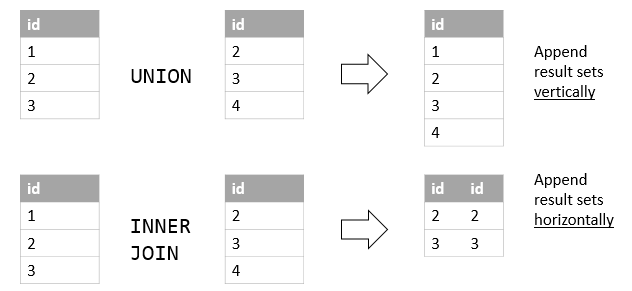
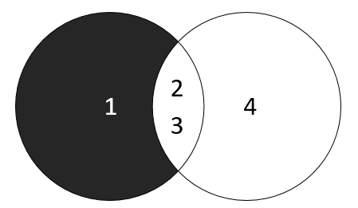
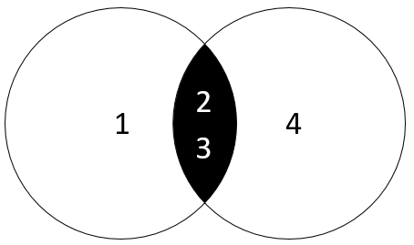

# Truy vấn con (Subquery) và đặt toán tử (Set Operators)

## Truy vấn con (Subquery)

### Mục đích của truy vấn con

- Truy vấn con (Subquery) là một truy vấn được nhúng vào một truy vấn khác. Truy vấn con thường được sử dụng để lấy dữ liệu từ một bảng và sử dụng kết quả của truy vấn con đó trong một truy vấn khác. 

### Cú pháp của truy vấn con

```sql
SELECT column1, column2, ...
FROM table_name
WHERE column1 operator (SELECT column1 FROM table_name WHERE condition);
```

### Ví dụ về truy vấn con

- Ví dụ: Lấy thông tin của nhân viên có mức lương cao nhất

```sql
SELECT * FROM employees WHERE salary = (SELECT MAX(salary) FROM employees);
```

- Ví dụ: Lấy thông tin của nhân viên có mức lương thấp nhất

```sql
SELECT * FROM employees WHERE salary = (SELECT MIN(salary) FROM employees);
```

- Derived table: Truy vấn con có thể được sử dụng như một bảng tạm thời trong câu truy vấn

```sql
SELECT column1, column2, ...
FROM (SELECT column1, column2, ... FROM table_name WHERE condition) AS derived_table;
```

## Đặt toán tử (Set Operators)

### Mục đích của đặt toán tử

- Đặt toán tử (Set Operators) được sử dụng để kết hợp kết quả của hai hoặc nhiều truy vấn. Có 3 loại đặt toán tử: `UNION`, `UNION ALL`, `INTERSECT`.

### Cú pháp của đặt toán tử

```sql
SELECT column1, column2, ...
FROM table1
UNION | UNION ALL | INTERSECT
SELECT column1, column2, ...
FROM table2;
```

- `UNION`: Kết hợp kết quả của hai truy vấn và loại bỏ các bản ghi trùng lặp (duplicate records).
- `UNION ALL`: Kết hợp kết quả của hai truy vấn và bao gồm tất cả các bản ghi (bao gồm cả các bản ghi trùng lặp).
- `INTERSECT`: Trả về các bản ghi mà có trong cả hai truy vấn.


- UNION vs JOIN: UNION kết hợp các bản ghi từ các truy vấn khác nhau, trong khi JOIN kết hợp các cột từ các bảng khác nhau.

- `EXCEPT`: Trả về các bản ghi mà chỉ có trong truy vấn đầu tiên và không có trong truy vấn thứ hai.

```sql
SELECT column1, column2, ...
FROM table1
EXCEPT 
SELECT column1, column2, ...
FROM table2;
```



- Trong hình trên thì khi sử dụng `EXCEPT` thì kết quả trả về là các bản ghi mà chỉ có trong truy vấn đầu tiên và không có trong truy vấn thứ hai.

- `INTERSECT`: Trả về các bản ghi mà có trong cả hai truy vấn. 

```sql
SELECT column1, column2, ...
FROM table1
INTERSECT
SELECT column1, column2, ...
FROM table2;
```



- Trong hình trên thì khi sử dụng `INTERSECT` thì kết quả trả về là các bản ghi mà có trong cả hai truy vấn.

## So sánh Set Operators và JOIN
- `JOIN` được sử dụng để kết hợp các cột từ các bảng khác nhau, trong khi `Set Operators` được sử dụng để kết hợp các bản ghi từ các truy vấn khác nhau.

