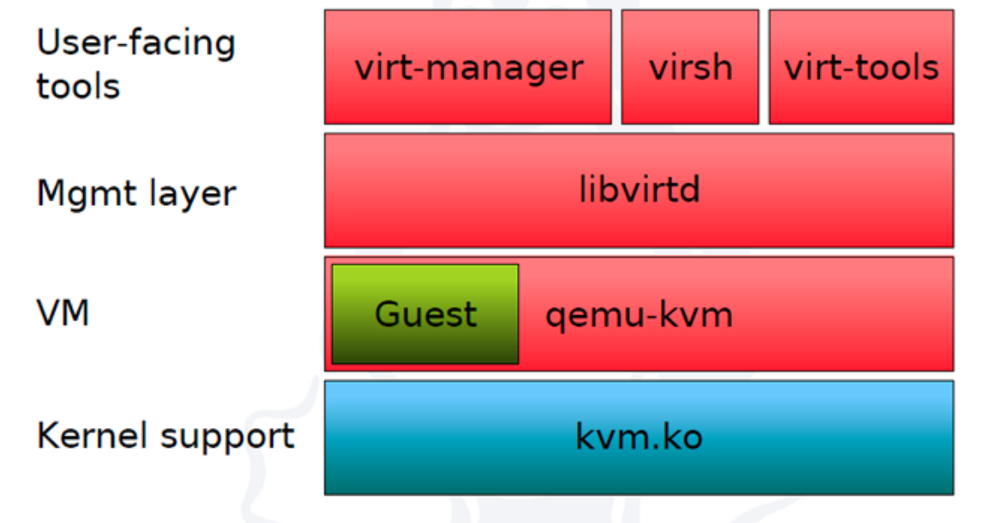

# 1. Giới thiệu về KVM

## 1. KVM là gì?

- Máy ảo sử dụng nhân (KVM) là một tính năng phần mềm mà bạn có thể cài đặt trên các máy Linux vật lý để tạo máy ảo. Máy ảo là một ứng dụng phần mềm hoạt động như một máy tính độc lập bên trong một máy tính vật lý khác. Máy ảo chia sẻ các tài nguyên như chu kỳ CPU, băng thông mạng và bộ nhớ với máy vật lý.
- KVM là một thành phần hệ điều hành Linux cung cấp hỗ trợ riêng cho các máy ảo trên Linux. KVM đã được cung cấp trong các bản phân phối Linux từ năm 2007.

## 2. KVM để làm gì?

- KVM cho phép người dùng tạo, chạy và quản lý các máy ảo trên một hệ thống vật lý. Mỗi máy ảo có thể chạy một hệ điều hành riêng biệt, bao gồm Linux, Windows, hoặc bất kỳ hệ điều hành nào khác được hỗ trợ.
- KVM giúp tận dụng tối đa tài nguyên phần cứng bằng cách cho phép nhiều máy ảo chia sẻ tài nguyên của một máy chủ vật lý duy nhất. Điều này giúp giảm chi phí phần cứng và tăng hiệu suất sử dụng tài nguyên.
- KVM được sử dụng rộng rãi trong việc triển khai các hạ tầng IT phức tạp, bao gồm các trung tâm dữ liệu và dịch vụ đám mây. Nó cho phép tạo ra và quản lý hàng trăm hoặc hàng ngàn máy ảo một cách hiệu quả và dễ dàng.
- Các nhà phát triển phần mềm sử dụng KVM để tạo ra các môi trường phát triển và kiểm thử linh hoạt. Họ có thể tạo ra nhiều máy ảo với các cấu hình khác nhau để kiểm thử ứng dụng trên nhiều hệ điều hành và cấu hình phần cứng.

## 3. Loại ảo hoá của KVM

- KVM thuộc loại Hypervisor loại 2 (host based): KVM là một phần mềm máy ảo hoá chạy trên hệ điều hành Linux. KVM cung cấp một môi trường máy ảo hoá cho các máy ảo chạy trên hệ điều hành Linux.

- Ưu điểm của KVM:

  - Linh hoạt: KVM hỗ trợ nhiều hệ điều hành khách, bao gồm Linux, Windows, Solaris, và BSD. Khi cài đặt KVM, bạn có thể chạy bất kỳ hệ điều hành nào hỗ trợ trên máy ảo của mình.
  - Bảo mật: KVM cung cấp một môi trường máy ảo hoá an toàn bằng cách sử dụng các công nghệ bảo mật như SELinux và cơ chế ảo hoá phần cứng.
  - Độ mở rộng: KVM cho phép tạo ra hàng trăm hoặc hàng ngàn máy ảo trên một hệ thống vật lý duy nhất. Bạn có thể mở rộng hệ thống của mình bằng cách thêm máy chủ vật lý mới vào cụm KVM của mình.

- Nhược điểm của KVM:
  - Yêu cầu cấu hình server vật lý rất cao.

# 2. Cấu trúc hoạt động của KVM

- Cấu trúc của KVM gồm 3 thành phần chính:

- KVM kernel module:
  - Là một module được tích hợp vào Linux kernel.
  - Cung cấp giao diện chung cho Intel VMX và AMD SVM (thành phần hỗ trợ ảo hóa phần cứng)
- quemu – kvm: là chương trình dòng lệnh để tạo các máy ảo, thường được vận chuyển dưới dạng các package “kvm” hoặc “qemu-kvm”. Có 3 chức năng chính:
  - Thiết lập VM và các thiết bị ra vào (input/output)
  - Thực thi mã khách thông qua KVM kernel module
  - Mô phỏng các thiết bị ra vào (I/O) và di chuyển các guest từ host này sang host khác
- libvirt management stack:
  - là một lớp quản lý, nó chịu trách nhiệm cung cấp API thực hiện các nhiệm vụ quản lý như cung cấp máy ảo, tạo, sửa đổi, giám sát, kiểm soát, di chuyển, v.v
  - libvirtd là một daemon chạy ngầm để cung cấp dịch vụ quản lý ảo hóa cho các tool như là virsh hay virt-manager.
  - Cung cấp chế độ quản lí từ xa an toàn.

# 3. Khác biệt giữa KVM và VMWare

- VMware là công ty phần mềm sản xuất VMware ESXi, một giải pháp ảo hóa được cấp phép thương mại. Phần mềm giám sát máy ảo của VMware được sử dụng trong ứng dụng dành cho doanh nghiệp, có các máy ảo sở hữu khả năng xử lý khối lượng công việc lớn.
- Máy ảo sử dụng nhân (KVM) và VMware ESXi đều mang đến cơ sở hạ tầng ảo hóa để triển khai các phần mềm giám sát máy ảo loại 1 trên nhân Linux. Tuy nhiên, KVM là một tính năng nguồn mở, còn VMware ESXi được cung cấp thông qua giấy phép thương mại.
- Các tổ chức sử dụng thành phần ảo hóa của VMware được đội ngũ kỹ thuật của công ty này hỗ trợ một cách chuyên nghiệp. Trong khi đó, người dùng KVM sẽ dựa vào cộng đồng nguồn mở rộng lớn để giải quyết những vấn đề tiềm ẩn.

# 4. Mối quan hệ của KVM với OS.

- KVM là một module của kernel Linux, có nghĩa là nó được tích hợp trực tiếp vào kernel. Điều này cho phép KVM sử dụng các tính năng và dịch vụ của kernel Linux để thực hiện các nhiệm vụ ảo hóa. Kernel Linux cung cấp các tài nguyên phần cứng và dịch vụ hệ thống cơ bản mà KVM cần để chạy các máy ảo.
- KVM sử dụng kernel Linux để quản lý tài nguyên hệ thống như CPU, bộ nhớ, và thiết bị I/O. Kernel Linux chịu trách nhiệm phân phối và quản lý các tài nguyên này giữa các máy ảo và hệ điều hành chủ.
- Mặc dù KVM là một phần của kernel Linux, nó có thể chạy nhiều hệ điều hành khác nhau dưới dạng máy ảo, bao gồm các bản phân phối Linux khác, Windows, và các hệ điều hành khác. 
- KVM được tích hợp trực tiếp vào kernel Linux, điều này giúp tối ưu hóa hiệu suất và bảo mật của máy ảo.
