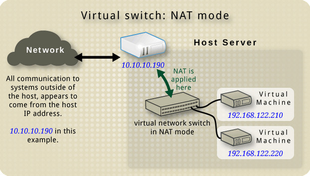
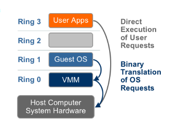

# Các chế độ Card mạng trong KVM

- Có 3 chế độ card mạng trong KVM:
  - **Bridge mode**: Card mạng ảo của máy ảo được kết nối trực tiếp với card mạng vật lý của máy host.
  - **NAT mode**: Card mạng ảo của máy ảo được kết nối với card mạng vật lý của máy host thông qua NAT.
  - **Host-only mode**: Card mạng ảo của máy ảo được kết nối với card mạng ảo của máy host.

## 1. NAT (Network Address Translation)

- VM có thể truy cập mạng bên ngoài thông qua máy chủ KVM, nhưng từ mạng bên ngoài không thể truy cập trực tiếp vào VM.
- Ưu điểm:
  - Đơn giản, dễ cấu hình.
  - An toàn vì các VM không thể truy cập trực tiếp từ mạng bên ngoài.
- Nhược điểm:
  - Không thể truy cập từ mạng bên ngoài vào VM.
- Trường hợp sử dụng: Sử dụng cho VM mà cần truy cập mạng bên ngoài nhưng không cần truy cập từ mạng bên ngoài vào VM.

## 2. Bridge mode

- VM được kết nối trực tiếp với mạng vật lý, như thể chúng là các máy tính vật lý trong mạng.
- Ưu điểm:
  - VM có địa chỉ IP từ mạng vật lý, giúp dễ dàng truy cập và quản lý.
  - Tích hợp tốt với các dịch vụ mạng hiện có.
- Nhược điểm:
  - Cần thiết lập phức tạp hơn so với NAT.
  - Có thể gây ra rủi ro bảo mật nếu không cấu hình đúng.
- Trường hợp sử dụng: Thích hợp cho các VM cần tương tác trực tiếp với các thiết bị khác trong mạng vật lý hoặc cần cung cấp các dịch vụ mạng.

## 3. Host-only mode

- VM chỉ có thể giao tiếp với máy chủ KVM và các VM khác trên cùng một mạng ảo, không có kết nối trực tiếp ra ngoài mạng vật lý.
- Ưu điểm:
  - An toàn vì không thể truy cập từ mạng bên ngoài vào VM.
  - Dễ cấu hình.
- Nhược điểm:
  - Không thể truy cập vào Internet hoặc mạng ngoài.
- Trường hợp sử dụng: Thích hợp cho các môi trường phát triển và kiểm thử nội bộ.
