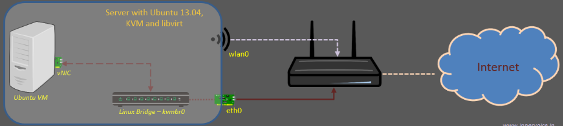
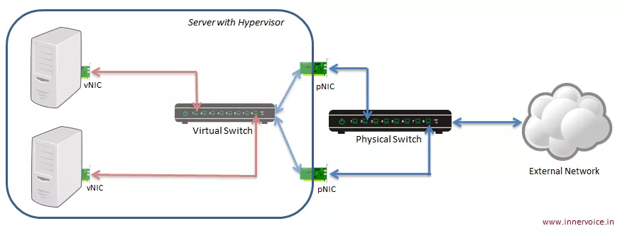
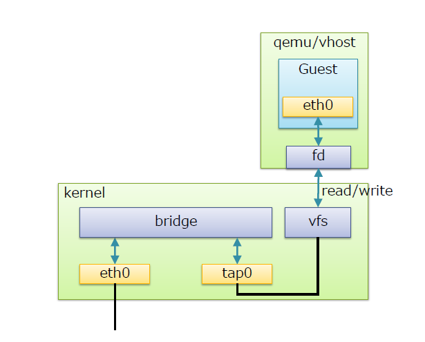
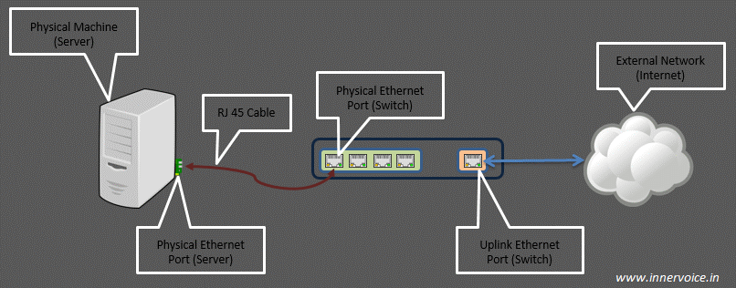

# Linux Bridge

## Mục lục

[1. Giới thiệu về Linux Bridge](#gioi-thieu-ve-linux-bridge)

[2. Cài đặt Linux Bridge](#cai-dat-linux-bridge)

[3. Cấu hình Linux Bridge](#cau-hinh-linux-bridge)

[4. Sử dụng Linux Bridge](#su-dung-linux-bridge)

# 1. Tổng quan về Linux Bridge

## 1. Giới thiệu.

- **Linux Bridge** là một công cụ giải quyết vấn đề ảo hoá network bên trong các máy vật lý.
- Linux Bridge sẽ tạo ra các switch layer 2 kết nối với các máy ảo VM để các VM có thể giao tiếp được với nhau và có thể kết nối được mạng ra ngoài. Nó là 1 switch ảo.
- Linux Bridge là một module của nhân Kernel. Sử dụng câu lệnh `brctl` để quản lý.

## 2. Cấu trúc hệ thống sử dụng Linux Bridge.

- Máy ảo giao tiếp qua vNIC: Các máy ảo trên server sử dụng các vNIC để giao tiếp với nhau và với mạng bên ngoài. Mỗi máy ảo có một vNIC kết nối đến virtual switch.
- Virtual Switch kết nối các vNIC: Virtual switch trên hypervisor kết nối các vNIC của các máy ảo lại với nhau và với pNIC của server. Các gói tin giữa các máy ảo được chuyển tiếp qua virtual switch.
- pNIC kết nối với Physical Switch: pNIC của server kết nối với physical switch trong mạng vật lý. Gói tin từ các máy ảo muốn ra ngoài mạng vật lý sẽ được chuyển từ virtual switch qua pNIC đến physical switch.
- Physical Switch chuyển tiếp gói tin: Physical switch chuyển tiếp các gói tin từ pNIC của server ra external network và ngược lại, cho phép các máy ảo giao tiếp với các thiết bị trong mạng vật lý và trên Internet.

# 2. Tìm hiểu về Linux Bridge

## 1. Cấu trúc và thành phần.

- Bridge: tương đương với switch layer 2
- Tap: hay tap interface có thể hiểu là giao diện mạng để các VM kết nối với bridge cho linux bridge tạo ra (nó nằm trong nhân kernel, hoạt động ở lớp 2 của mô hình OSI)
- fd: forward data - chuyển tiếp dữ liệu từ máy ảo tới bridge.

## 2. Các tính năng.

- STP: Spanning Tree Protocol - giao thức chống loop gói tin trong mạng.
- VLAN: chia switch (do linux bridge tạo ra) thành các mạng LAN ảo, cô lập traffic giữa các VM trên các VLAN khác nhau của cùng một switch.
- FDB: chuyển tiếp các gói tin theo database để nâng cao hiệu năng switch.

# 3. Một số khái niệm liên quan.

## 1. Port

Trong networking, khái niệm "port" đại diện cho điểm vào ra của dữ liệu trên máy tính hoặc các thiết bị mạng và có thể là phần mềm hoặc phần cứng:

- Software port: Tồn tại trong hệ điều hành, là điểm vào ra cho lưu lượng ứng dụng, ví dụ: port 80 cho HTTP trên Web server.
- Hardware port: Là điểm kết nối vật lý trên thiết bị mạng như switch, router, máy tính, ví dụ: cổng RJ45 trên router.
- Physical switch port: Các cổng RJ45 trên switch L2/Ethernet, kết nối tới NIC của máy tính.
- Virtual switch port: Giống như physical switch port nhưng tồn tại dưới dạng phần mềm trên switch ảo, với vNIC và vPort được kết nối qua virtual cable.

## 2. Uplink port

- Uplink port là khái niệm chỉ điểm vào ra của lưu lượng trong một switch ra các mạng bên ngoài. Nó sẽ là nơi tập trung tất cả các lưu lượng trên switch nếu muốn ra mạng ngoài.

- Virtual uplink switch port là điểm mà lưu lượng từ các máy ảo (guest) đi ra ngoài máy chủ thật (host) hoặc mạng ngoài. Khi thêm một giao diện mạng của máy chủ vào bridge, giao diện này trở thành virtual uplink port.

## 3. Tap interface

- vNIC (Virtual NIC): Là Ethernet port mô phỏng trên máy ảo VM, hỗ trợ bởi KVM/QEMU.
- Chức năng: Giống NIC vật lý, vNIC chỉ xử lý các frame Ethernet. Trong môi trường ảo hóa, vNIC nhận các khung Ethernet thô qua tap interface.
- Tap interface: Là phần mềm cho phép Linux bridge chuyển tiếp frame Ethernet đến máy ảo, giúp VM hoạt động như máy vật lý trong mạng.
- Tóm lại: Tap interface là một port trên switch dùng để kết nối với các máy ảo VM.
