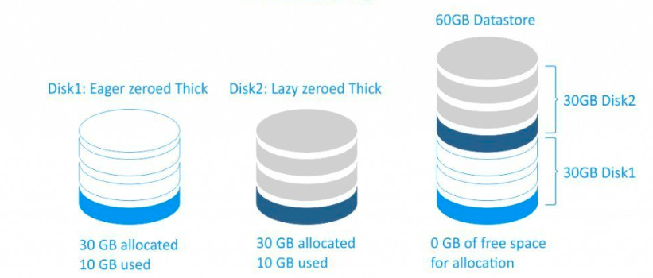
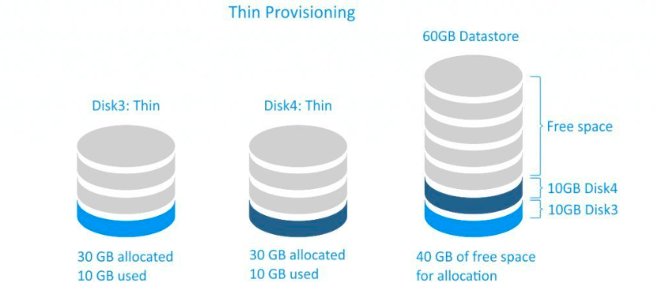

# Cơ chế lưu trữ Thin-Thick

# 1. Thick Provisioning

- Với cơ chế này, khi tạo 1 disk ảo cho VM, nó sẽ nhận luôn dung lượng của disk đó dù chưa sử dụng hết.

- Ví dụ: Tạo 1 disk 20GB, nhưng chỉ sử dụng 5GB, thì disk ảo này vẫn chiếm 20GB trên ổ cứng thật.

- Thick có 2 loại:

### 1. Thick Provision Lazy Zeroed

- Khi tạo disk ảo, nó sẽ chiếm dung lượng trên ổ cứng thật, nhưng không làm việc gì cả, chỉ khi có yêu cầu ghi dữ liệu vào disk ảo thì nó mới ghi dữ liệu vào ổ cứng thật.
- Điều này giúp tạo disk nhanh hơn, nhưng khi ghi dữ liệu vào disk ảo, nó sẽ chậm hơn so với disk thick provision eager zeroed.

### 2. Thick Provision Eager Zeroed

- Khi tạo disk ảo, nó sẽ chiếm dung lượng trên ổ cứng thật và ghi dữ liệu 0 vào disk ảo ngay lập tức.
- Điều này giúp tạo disk chậm hơn so với disk thick provision lazy zeroed, nhưng khi ghi dữ liệu vào disk ảo, nó sẽ nhanh hơn.

# 2. Thin Provisioning

- Tiết kiệm không gian: Không gian lưu trữ chỉ được cấp phát khi dữ liệu thực sự được ghi vào đĩa. Điều này giúp tiết kiệm dung lượng lưu trữ và tối ưu hóa việc sử dụng tài nguyên.
- Hiệu quả về chi phí: Giảm chi phí lưu trữ do không cần phải mua trước toàn bộ dung lượng lưu trữ.
- Quản lý linh hoạt: Dễ dàng quản lý và mở rộng dung lượng lưu trữ khi cần thiết.