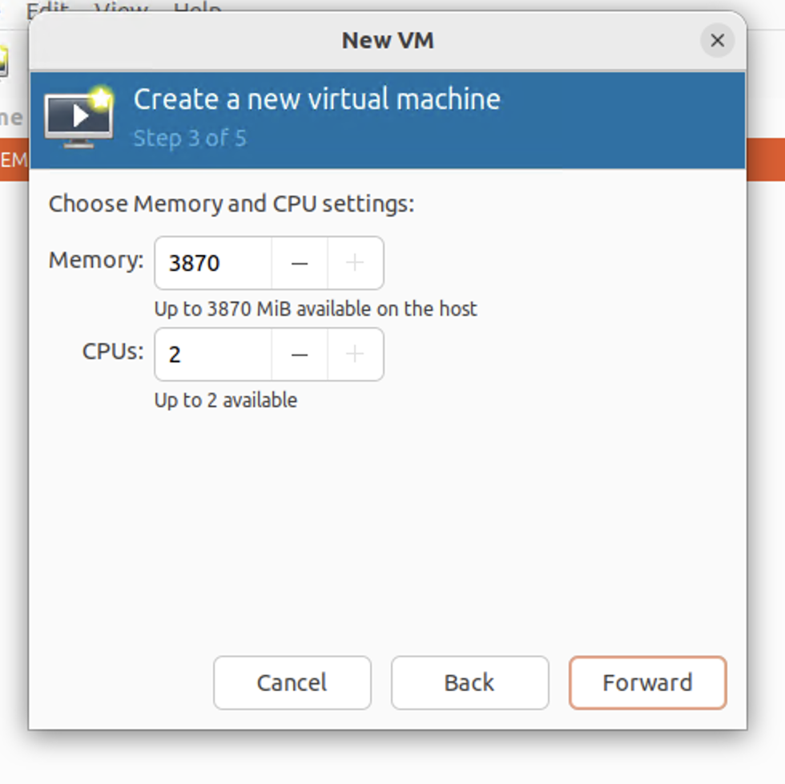
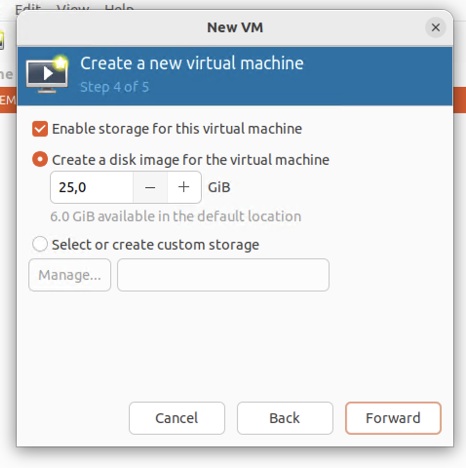
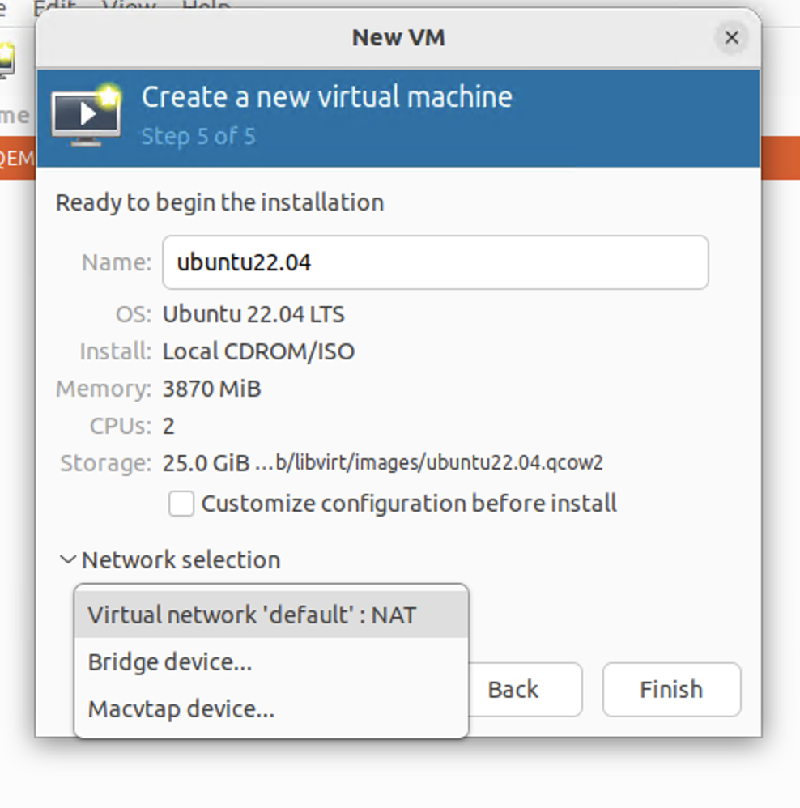

# Các option khi tạo một VM (CPU, disk, NIC)

## 1. CPU

- Có thể tuỳ chỉnh dung lượng RAM và số CPU ảo cho VM.

## 2. Disk

- Có thể tuỳ chỉnh dung lượng disk ảo cho VM.

## 3. NIC

- Tùy vào mục đích tạo VM để chọn kiểu card mạng cho thích hợp. Có thể để kết nối ra ngoài mạng internet hoặc để dạng NAT

