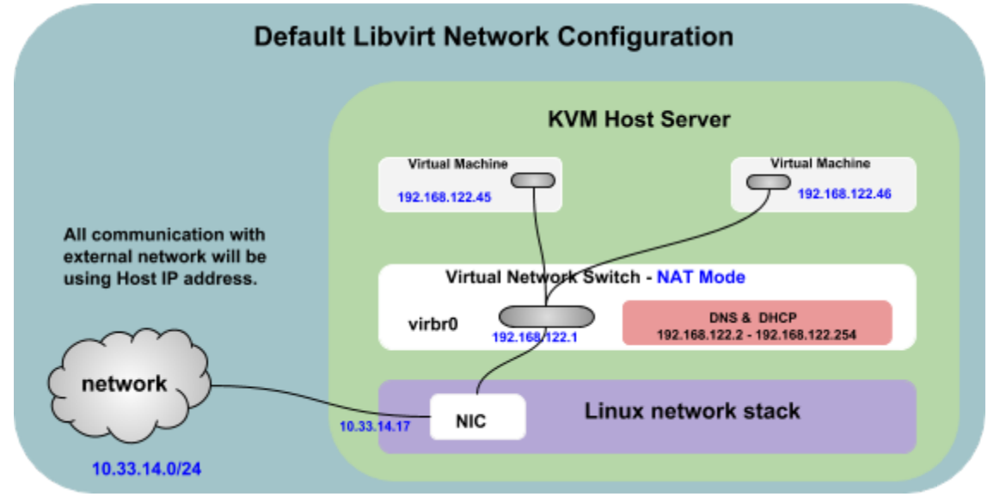
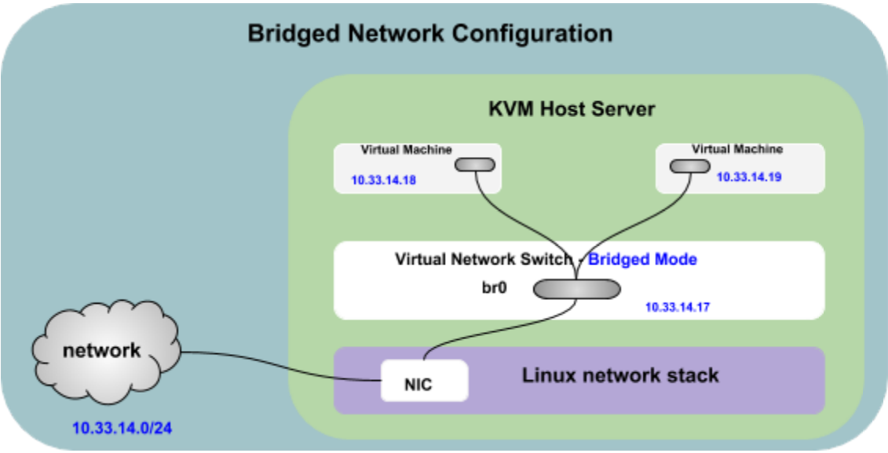

# Phân tích đường đi của các gói tin trong các chế độ card mạng của KVM

- Trong KVM, có 3 chế độ card mạng chính: Bridge mode, NAT mode và Host-only mode. Mỗi chế độ sẽ có cách hoạt động và đường đi của gói tin khác nhau.

## 1. NAT (Network Address Translation)

### 1. Đường đi của các gói tin từ VM ra mạng bên ngoài

- Một máy ảo (có IP 192.168.122.45) muốn kết nối với mạng bên ngoài, packet xuất phát từ máy ảo và được gửi đến switch ảo (`virbr0`).
- Switch ảo đang ở chế độ NAT và có địa chỉ IP `192.168.122.1`, `virbr0` sẽ chuyển đổi địa chỉ IP của máy ảo thành địa chỉ IP của máy chủ host (`10.33.14.17`) cho lưu lượng đi ra ngoài.
- Gói tin ra khỏi máy chủ thông qua Card mạng (NIC) vật lý của máy chủ host.
- Gói tin đã chuyển đến mạng `10.33.14.0/24` và mạng này cho biết gói tin này xuất phát từ `10.33.14.17`.

### 2. Đường đi của các gói tin khi trả về VM.

- Gói tin phản hồi từ mạng bên ngoài được gửi đến địa chỉ IP của máy chủ (10.33.14.17).
- Gói tin đi vào máy chủ thông qua card mạng (NIC) vật lý.
- `Virbr0` chuyển đổi địa chỉ đích từ IP của máy chủ (10.33.14.17) thành địa chỉ IP riêng của máy ảo (192.168.122.45).
- Gói tin cuối cùng được chuyển đến đúng máy ảo (192.168.122.45).

## 2. Bridge mode 

### 1. Đường đi của các gói tin từ VM ra mạng bên ngoài

- Một máy ảo (có IP 10.33.14.18) muốn kết nối với mạng bên ngoài, packet xuất phát từ máy ảo và được gửi đến bridge interface (br0).
- Bridge interface sẽ chuyển gói tin đến card mạng vật lý (NIC) của máy chủ host.
- Gói tin đi qua NIC vật lý và đến mạng bên ngoài, packet sẽ xuất phát từ IP của máy ảo (10.33.14.18).

### 2. Đường đi của các gói tin khi trả về VM.

- Packet từ mạng bên ngoài được gửi đến địa chỉ IP của máy ảo (10.33.14.18).
- Packet đi vào trong NIC vật lý và được chuyển đến bridge interface (br0).
- Packet sẽ được chuyển đến đúng máy ảo có IP là 10.33.14.18.

## 3. Host-only mode

- Đối với chế độ Host-only, máy ảo chỉ có thể giao tiếp với nhau thông qua một switch ảo và không thể giao tiếp với mạng bên ngoài.