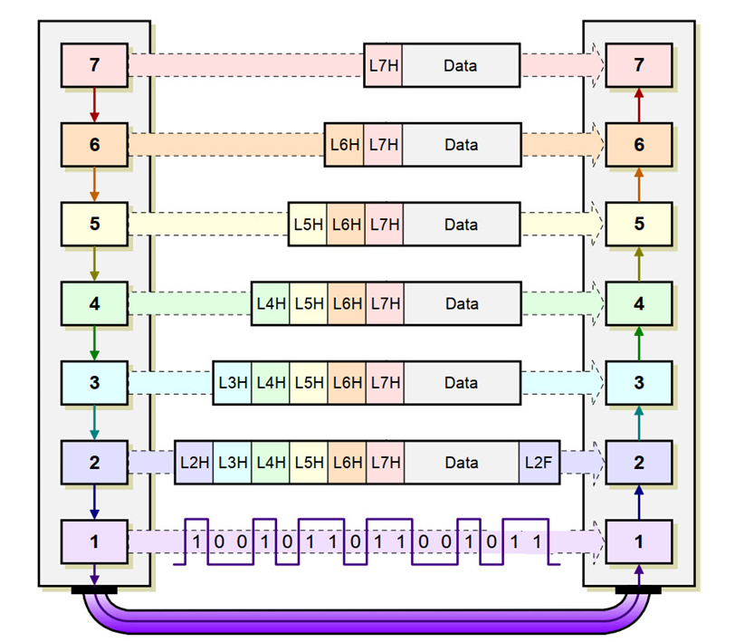

## Mô hình OSI

### Lớp 1: Lớp Vật Lý (Physical Layer)

- Lớp vật lý là phương tiện truyền dẫn vật lý và các công nghệ để truyền dữ liệu qua phương tiện đó.
- Về cốt lõi, hoạt động truyền dữ liệu là việc **truyền tín hiệu kỹ thuật số và điện tử thông qua các kênh vật lý khác nhau như cáp quang, cáp đồng và không khí**.
- PCS, PMA và PMD là ba lớp con của lớp vật lý (PHY) trong mô hình OSI.
  - PCS **(Physical Coding Sublayer)** chịu trách nhiệm mã hóa và giải mã dữ liệu bit.
  - PMA **(Physical Medium Attachment)** chịu trách nhiệm kết nối thiết bị với môi trường truyền dẫn.
  - PMD **(Physical Medium Dependent)** chịu trách nhiệm các đặc điểm vật lý của môi trường truyền dẫn.

### Lớp 2: Lớp Liên Kết Dữ Liệu (Data Link Layer)

- Lớp này quản lý khung dữ liệu – là các tín hiệu kỹ thuật số được gói gọn trong các packet.
- Lớp liên kết dữ liệu thường được chia thành hai lớp phụ: lớp Kiểm soát truy cập phương tiện **(Media Access Control – MAC)** và **lớp Điều khiển liên kết logic (Logical Link Control – LLC)**.
- LLC - Logical Link Control:
  - LLC phát hiện lỗi truyền dẫn trong các khung dữ liệu và thực hiện các cơ chế khắc phục, như yêu cầu gửi lại khung bị lỗi.
  - Điều khiển luồng dữ liệu giữa người gửi và người nhận để tránh làm quá tải bộ đệm của người nhận.
  - Quản lý bộ đệm và đảm bảo rằng dữ liệu được xử lý và truyền một cách hiệu quả, cũng như ngăn chặn tràn bộ đệm.
- MAC - Media Access Control:
  - Phát hiện điểm bắt đầu và kết thúc của một khung dữ liệu, giúp thiết bị nhận có thể định dạng và xử lý thông tin một cách chính xác.
  - Sử dụng địa chỉ MAC để xác định thiết bị nguồn và đích của mỗi khung dữ liệu, đảm bảo dữ liệu được gửi đến đúng nơi.

### Lớp 3: Lớp Mạng (Network Layer)

- Định địa chỉ logic: Nếu packet chuyển từ một mạng đến mạng khác, lớp mạng sẽ thay đổi địa chỉ vật lý của packet, nhưng giữ nguyên địa chỉ logic. Điều này giúp packet đến đúng đích.
- Định tuyến: Khi mạng kết nối với nhau sẽ tạo thành một liên mạng, các thiết bị trung gian (router, gateway) sẽ quyết định đường đi tốt nhất cho packet.

### Lớp 4: Lớp Giao Thức (Transport Layer)

- Địa chỉ cổng (ports): Các máy tính thường chạy nhiều chương trình cùng một thời điểm, vì vậy việc chuyển thông điệp là chuyển từ tiến trình trên máy gửi đến tiến trình trên máy nhận.
- Segment: Mỗi thông điệp được chia thành các đoạn nhỏ hơn, mỗi đoạn có địa chỉ cổng và số thứ tự.
- Kiểm soát kết nối: Kết nối hướng nối và không hướng nối. VD: TCP (hướng nối) và UDP (không hướng nối).
- Kiểm soát lỗi: Kiểm tra lỗi được thực hiện ở các thiết bị đầu cuối (việc khắc phục lỗi thường được thực hiện bằng cách yêu cầu truyền lại).

### Lớp 5: Lớp Phiên (Session Layer)

- Kiểm soát phiên: Cho phép 2 thiết bị tham gia phiên giao tiếp với nhau.
- Đồng bộ hóa: Cho phép một tiến trình thêm vào các mốc (synchronization point) vào luồng dữ liệu. Ví dụ: Nếu hệ thống gửi 1 file có 2000 trang, cứ sau 100 trang, hệ thống sẽ thêm một mốc để đảm bảo rằng việc nhận từng cụm 100 trang được thực hiện độc lập. Nếu như có lỗi ở trang 523, hệ thoongs sẽ bắt đầu lại từ trang 501 chứ không phải từ trang 1.

### Lớp 6: Lớp Trình Diễn (Presentation Layer)

- Phiên dịch (Translation): Chuyển đổi dữ liệu từ định dạng của máy gửi sang định dạng của máy nhận.
- Mã hóa (Encryption): Mã hóa dữ liệu để đảm bảo an toàn trong quá trình truyền dữ liệu.
- Nén (Compression): Nén dữ liệu để giảm dung lượng và tăng tốc độ truyền dữ liệu.

### Lớp 7: Lớp Ứng Dụng (Application Layer)

- Lớp ứng dụng là lớp mà người dùng cuối cùng tương tác với.
- Cung cấp các dịch vụ:
  - Thiết bị đầu cuối ảo mạng: Phiên bản phần mềm của thiết bị đầu cuối vật lý, cho phép người dùng đăng nhập vào một máy chủ từ xa. Ví dụ: Telnet, SSH.
  - Quản lý, truy cập, chuyển file: Cho phép người dùng truy cập và quản lý file từ xa. Ví dụ: FTP, SFTP.
  - Các dịch vụ khác: Email, Web, DNS, DHCP, ...

## Tổng kết

| Lớp             | Chức năng                     | Data Unit |
| --------------- | ----------------------------- | --------- |
| 7. Application  | Cung cấp giao diện người dùng | Data      |
| 6. Presentation | Xử lý dữ liệu                 | Data      |
| 5. Session      | Quản lý phiên làm việc        | Data      |
| 4. Transport    | Đảm bảo giao tiếp             | Segment   |
| 3. Network      | Định tuyến                    | Packet    |
| 2. Data Link    | Quản lý lưu lượng và lỗi      | Frame     |
| 1. Physical     | Truyền dẫn                    | Bit       |
