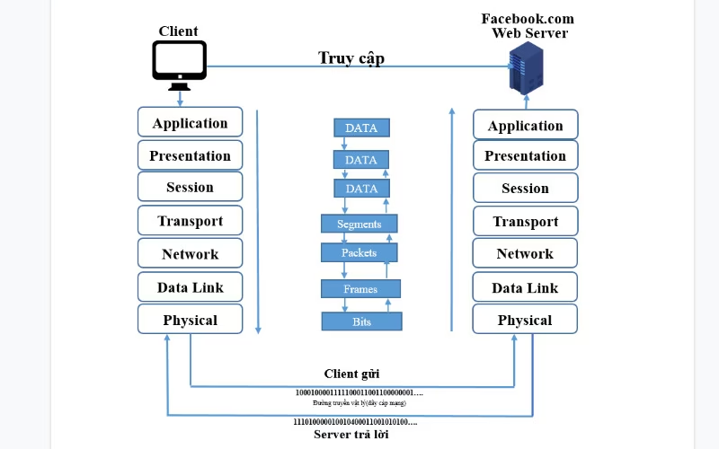
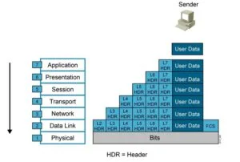
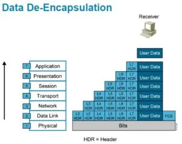

## Cách mô hình OSI hoạt động khi gửi dữ liệu đăng nhập từ máy client đến server:

### Tổng quan

Dữ liệu sẽ được truyền từ tầng Application đến tầng Physical của máy client, sau đó truyền qua các tầng Physical đến tầng Application của máy chủ.

### Khi client gửi thông tin cho server:

- Tầng Application: Mở ứng dụng facebook ra.
- Tầng Presentation: Nhập thông tin đăng nhập, sau đó mã hoá cú pháp thông tin đăng nhập rồi chuyển đến tầng Session.
- Tầng Session: Thông tin vừa nhận được từ tầng Session sẽ được gắn thêm một số thông tin như IP source (IP từ người gửi), IP đích (IP của server facebook), port để gửi và chuyển đến tầng Transport.
- Tầng Transport: Cắt nhỏ các thông tin vừa nhận được chia thành các segment, mỗi phần được gắn IP source, IP đích, port để gửi (gọi là các packet). Sau đó chuyển các packet này đến tầng Network.
- Tầng Network: Thêm thông tin định tuyến cho các packet vừa nhận được, điều này giúp định tuyến đường đi cho các packet. Sau đó chuyển các packet này đến tầng Data Link.
- Tầng Data Link: Thực hiện gán địa chỉ source MAC, địa chỉ đích MAC cho packet để tạo thành frame.
- Tầng Physical: Biến frame thành các chuỗi bit (0,1) và được đưa lên các thiết bị truyền dẫn (cable mạng, không khí,..) để truyền dữ liệu đến máy chủ.

### Khi server nhận được thông tin:

- Tầng Physical: Nhận tín hiệu điện tử từ cable mạng, sau đó thông báo cho tầng Data Link rằng dữ liệu đã được nhận.
- Tầng Data Link: Nhận frame từ tầng Physical, giải mã frame, lấy thông tin địa chỉ MAC source, địa chỉ MAC đích. Kiểm tra địa chỉ MAC đích có phải là địa chỉ của máy chủ hay không, nếu đúng thì gửi frame lên tầng Network và gỡ bỏ header của tầng Data Link.
- Tầng Network: Nhận dữ liệu từ tầng Data Link, kiểm tra thông tin xem có chứa IP là IP máy đích không, nếu đúng thì gỡ bỏ header của tầng Network và chuyển đến tầng Transport.
- Tầng Transport: Nhận các thông tin từ tầng Network,kiểm tra và phục hồi dữ liệu nếu có lỗi bằng cách gửi các gói tin ACK và NAK (gói tin để phản hồi xem gói tin chứa dữ liệu đã được gửi đến máy nhận hay chưa), sau đó gỡ bỏ header của tầng Transport và chuyển đến tầng Session.
- Tầng Session: Nhận thông tin từ tầng Transport, đảm bảo dữ liệu trong gói tin được toàn vẹn ,gỡ bỏ header của tầng Session và chuyển đến tầng Presentation.
- Tầng Presentation: Nhận thông tin từ tầng Session, chuyển đổi thông tin thành các định dạng dữ liệu phù hợp. Sau đó gỡ bỏ header của tầng Presentation và chuyển đến tầng Application.
- Tầng Application: Nhận thông tin từ tầng Presentation, lấy thông tin email, password, gỡ bỏ header cuối cùng và dữ liệu đã được truyền đến server.
