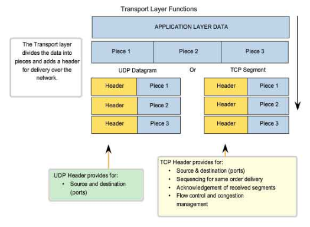

## Mô hình TCP/IP

Một mô hình TCP/IP tiêu chuẩn bao gồm 4 lớp được chồng lên nhau, bắt đầu từ tầng thấp nhất là **Tầng truy cập mạng (Network Access)** → **Tầng mạng (Internet)** → **Tầng giao vận (Transport)** → **Tầng ứng dụng (Application).**

### 1. Tầng truy cập mạng (Network Access)

- Kết hợp giữa tầng 1 và tầng 2 trong mô hình OSI.
- Chịu trách nhiệm về việc truyền dữ liệu giữa các thiết bị mạng.
- Tại đây dữ liệu được đóng gói thành các frame và được định tuyến đến đích.

### 2. Tầng mạng (Internet)

- Tương đương với tầng 3 trong mô hình OSI.
- Chịu trách nhiệm về việc định tuyến dữ liệu giữa các mạng khác nhau.
- Tại đây dữ liệu được đóng gói thành các packet với kích thước phù hợp, packet sẽ được chèn thêm phần Header chứa thông tin về tầng mạng và chuyển đến tầng tiếp theo.
- Các giao thức phổ biến: IP, ICMP, ARP, RARP.

### 3. Tầng giao vận (Transport)

- Tương đương với tầng 4 trong mô hình OSI.
- Chịu trách nhiệm về việc đảm bảo dữ liệu được truyền tải một cách an toàn và đúng thứ tự.
- Các giao thức phổ biến: TCP, UDP.

  - TCP – Transmission Control Protocol: cung cấp luồng dữ liệu tin cậy giữa 2 trạm nhờ nhiều cơ chế. Ví dụ như chia nhỏ các gói tin ở tầng trên thành các gói tin có kích thước thích hợp cho tầng mạng bên dưới, báo nhận gói tin, đặt hạn chế thời gian timeout để đảm bảo bên nhận biết được các gói tin đã gửi đi.

  - UDP – User Datagram Protocol: gửi dữ liệu từ trạm này tới trạm kia mà không đảm bảo các gói tin đến được tới đích.

### 4. Tầng ứng dụng (Application)

- Tương đương với tầng 5, 6, 7 trong mô hình OSI.
- Chịu trách nhiệm về giao tiếp dữ liệu giữa 2 máy khác nhau.
- Các giao thức phổ biến: HTTP, FTP, SMTP, POP3, IMAP, Telnet, SSH.
