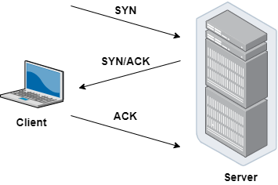
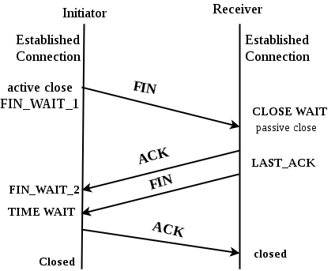

## Cách mô hình TCP/IP hoạt động khi A gửi dữ liệu cho B:

**Khi client gửi email:**

- Tầng Application: Đưa thông tin vào máy tính, các dữ liệu đi theo luồng được gọi là stream sẽ được chuyển đến tầng Transport.
- Tầng Transport: Nhận dữ liệu từ tầng Application, chia dữ liệu thành các segment, mỗi segment sẽ được gắn các thông tin về dữ liệu để gửi xuống tầng Network. Ở đây, cần phải thiết lập kết nối giữa client và server. Sử dụng giao thức TCP để thiết lập kết nối. Quá trình này được gọi là 3 bước bắt tay (3-way handshake).
- Tầng Internet: Nhận các segment từ tầng Transport, thêm thông tin định tuyến cho các segment tạo thành packet, các packet được đóng thành frame và chuyển đến tầng Network.
- Tầng Network: Nhận frame từ tầng Network, biến frame thành các chuỗi bit (0,1).

**Khi server nhận được thông tin:**

- Tầng Network: Máy nhận được chuỗi bit (0,1), biến chuỗi bit thành frame và chuyển đến tầng Internet
- Tầng Internet: Nhận frame từ tầng Network, giải mã frame, kiểm tra xem frame có bị lỗi hay không, nếu không thì gỡ bỏ header của tầng Network và chuyển đến tầng Transport.
- Tầng Transport: Nhận packet từ tầng Network, giải mã packet, ghem các packet lại thành segment ban đầu và chuyển đến tầng Application.
- Tầng Application: Nhận segment từ tầng Transport, giải mã segment, lấy thông tin dữ liệu ở bên client.

**Bắt tay 3 bước:**

Trước khi gửi dữ liệu từ máy client đến máy chủ, cần thiết lập kết nối giữa máy client và máy chủ. Khi kết nối được thiết lập, máy client sẽ gửi dữ liệu đến máy chủ, máy chủ nhận dữ liệu và trả về kết quả cho máy client. Quá trình này được gọi là 3 bước bắt tay (3-way handshake). Cụ thể như sau:

- Bước 1: Máy client gửi thông điệp SYN đến máy chủ.
- Bước 2: Máy chủ nhận thông điệp SYN từ máy client và gửi thông điệp SYN và ACK đến máy client.
- Bước 3: Máy client nhận thông điệp SYN và ACK từ máy chủ và gửi thông điệp ACK đến máy chủ.

**Bắt tay 4 bước:**

Khi máy client không cần kết nối nữa, máy client sẽ gửi thông điệp FIN đến máy chủ, máy chủ nhận thông điệp FIN và gửi thông điệp ACK đến máy client, sau đó máy chủ gửi thông điệp FIN đến máy client, máy client nhận thông điệp FIN và gửi thông điệp ACK đến máy chủ. Quá trình này được gọi là 4 bước bắt tay (4-way handshake). Khi quá trình 4 bước bắt tay hoàn tất, kết nối giữa máy client và máy chủ sẽ bị đóng. Cụ thể như sau:

- Bước 1: Máy client gửi thông điệp FIN đến máy chủ.
- Bước 2: Máy chủ nhận thông điệp FIN từ máy client và gửi thông điệp ACK đến máy client.
- Bước 3: Máy chủ gửi thông điệp FIN đến máy client.
- Bước 4: Máy client nhận thông điệp FIN từ máy chủ và gửi thông điệp ACK đến máy chủ.
