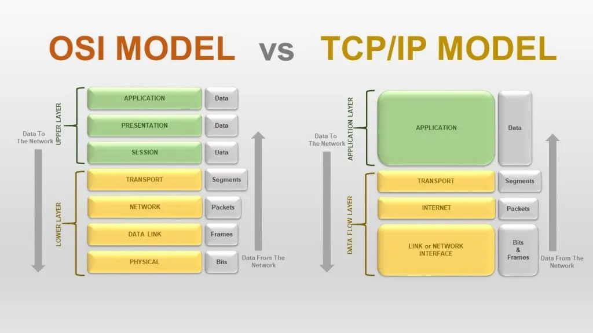
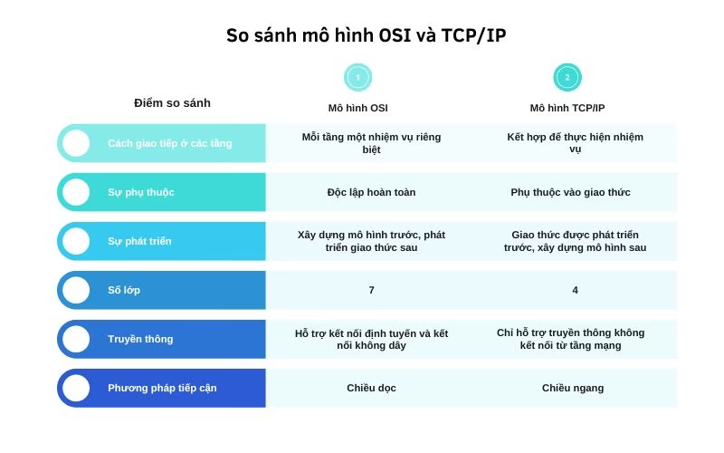

## So sánh mô hình OSI và mô hình TCP/IP

### Giống nhau

- Cả hai đều có mô hình lớp.
- Cả hai đều có lớp mạng và lớp vận chuyển gần giống nhau.
- Cả hai đều cho gói tin đi qua nhiều lớp trước khi đến đích.
- Cả mô hình OSI và TCP/IP đều có cấu trúc các giao thức xếp chồng lên nhau theo các lớp.
- Hai mô hình phân chia các giao tiếp mạng thành các lớp rõ ràng.

### Khác nhau

### Nên sử dụng mô hình nào?

- **Mô hình OSI**: Mô hình OSI được thiết kế để mô tả cách mạng hoạt động, không phải là một mô hình thực tế. Mô hình OSI không được sử dụng trong thực tế, nhưng nó cung cấp một cách tiếp cận tốt để hiểu cách mạng hoạt động.

- **Mô hình TCP/IP**: Mô hình TCP/IP được sử dụng rộng rãi trong thực tế. Mô hình này được sử dụng để thiết kế, xây dựng và quản lý mạng. Mô hình TCP/IP cung cấp một cách tiếp cận thực tế để hiểu cách mạng hoạt động.
