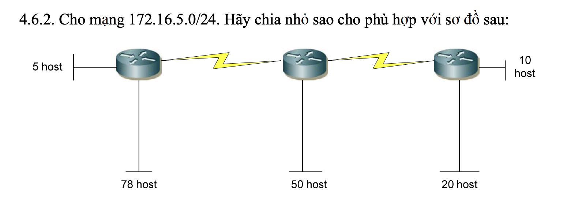
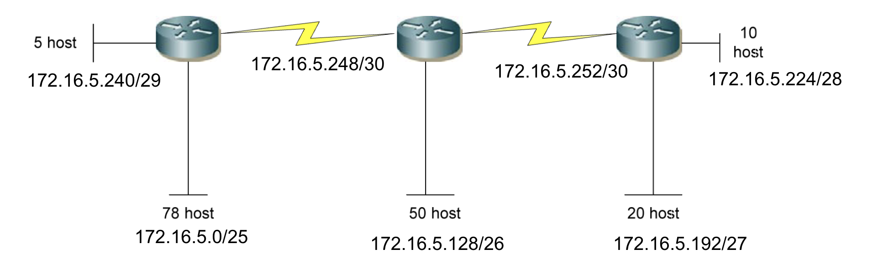

### Bài 1: Cho biết địa chỉ nào sau đây có thể dùng cho host:

150.100.255.255 là địa chỉ lớp B, 16 bit cuối là phần host, tuy nhiên đây là tất cả bit cuối đều là 1 nên nó là địa chỉ broadcast, không thể dùng cho host.

175.100.255.18 là địa chỉ lớp B, 16 bit cuối là phần host, có thể dùng cho host.

195.234.253.0 là địa chỉ lớp C, 8 bit cuối là phần host, tuy nhiên 8 bit cuối đều là 0 nên nó là địa chỉ mạng, không thể dùng cho host.

100.0.0.23 là địa chỉ lớp A, 24 bit cuối là phần host, có thể dùng cho host.

188.258.221.176 không thuộc bất kỳ lớp nào nên không thể dùng cho host.

127.34.25.189 không thuộc bất kỳ lớp nào nên không thể dùng cho host.

224.156.217.73 đây là địa chỉ lớp D dùng cho multicast, không thể dùng cho host.

### Bài 2: Cho mạng và số bit mượn. Giả sử có hỗ trợ subnet zero. Hãy xác định :

- Số subnet có thể có.
- Số host/subnet.
- Với mỗi subnet, hãy xác định: địa chỉ mạng, địa chỉ host đầu, địa chỉ host cuối,
  địa chỉ broadcast (nếu số lượng mạng quá nhiều chỉ cần ghi ra một vài mạng đầu
  và mạng cuối cùng), subnet mask và số prefix.

a. 192.168.2.0/24 mượn 5 bit.

- Số subnet có thể có: 2^5 = 32 subnet.
- Số host trong 1 subnet: 2^3 - 2 = 6 host.
- Bị chia cắt tại octet thứ 4, số bit mượn là 5 nên số bước nhảy là 2^3 = 8.
- Prefix: /29
- Subnet mask: 255.255.255.248

```
--------------------------------------
192.168.2.0/29 -> địa chỉ mạng
192.168.2.1/29 -> địa chỉ host
.......
192.168.2.6/29 -> địa chỉ host
192.168.2.7/29 -> địa chỉ broadcast
--------------------------------------
.......
--------------------------------------
192.168.2.247/29 -> địa chỉ mạng
192.168.2.248/29 -> địa chỉ host
.......
192.168.2.254/29 -> địa chỉ host
192.168.2.255/29 -> địa chỉ broadcast
--------------------------------------

```

b. 10.0.0.0/8 mượn 10 bit.

- Số subnet có thể có: 2^10 = 1024 subnet.
- Số host trong 1 subnet: 2^14 - 2 = 16382 host.
- Bị chia cắt tại octet thứ 3, số bit mượn là 2, số bước nhảy là 2^6 = 64.
- Prefix: /18
- Subnet mask: 255.255.192.0

```
--------------------------------------
10.0.0.0/18 -> địa chỉ mạng
10.0.0.1/18 -> địa chỉ host
.......
10.0.0.255/18 -> địa chỉ host
10.0.1.0/18 -> địa chỉ host
.......
10.0.1.255/18 -> địa chỉ host
.......
10.0.63.254/18 -> địa chỉ host
10.0.63.255/18 -> địa chỉ broadcast
--------------------------------------

--------------------------------------

10.0.64.0/18 -> địa chỉ mạng
10.0.64.1/18 -> địa chỉ host
.......
10.0.64.255/18 -> địa chỉ host
10.0.65.0/18 -> địa chỉ host
.......
10.0.65.255/18 -> địa chỉ host
.......
10.0.127.254/18 -> địa chỉ host
10.0.127.255/18 -> địa chỉ broadcast
--------------------------------------

--------------------------------------

10.0.128.0/18 -> địa chỉ mạng
10.0.128.1/18 -> địa chỉ host
.......
10.0.128.255/18 -> địa chỉ host
10.0.129.0/18 -> địa chỉ host
.......
10.0.129.255/18 -> địa chỉ host
.......
10.0.191.254/18 -> địa chỉ host
10.0.191.255/18 -> địa chỉ broadcast
--------------------------------------

--------------------------------------
10.0.192.0/18 -> địa chỉ mạng
10.0.192.1/18 -> địa chỉ host
.......
10.0.192.255/18 -> địa chỉ host
10.0.193.0/18 -> địa chỉ host
.......
10.0.193.255/18 -> địa chỉ host
.......
10.0.255.254/18 -> địa chỉ host
10.0.255.255/18 -> địa chỉ broadcast
--------------------------------------

.......

--------------------------------------
10.255.192.0/18 -> địa chỉ mạng
10.255.192.1/18 -> địa chỉ host
.......
10.255.192.255/18 -> địa chỉ host
10.255.193.0/18 -> địa chỉ host
.......
10.255.193.255/18 -> địa chỉ host
.......
10.255.255.254/18 -> địa chỉ host
10.255.255.255/18 -> địa chỉ broadcast
--------------------------------------
```

c. 172.16.0.0/16 mượn 3 bit

- Số subnet có thể có: 2^3 = 8 subnet.
- Số host trong 1 subnet: 2^13 - 2 = 8190 host.
- Bị chia cắt tại octet thứ 3, số bit mượn là 3, số bước nhảy là 2^5 = 32.
- Prefix: /19
- Subnet mask: 255.255.224.0

```
--------------------------------------
172.16.0.0/19 -> địa chỉ mạng
172.16.0.1/19 -> địa chỉ host
.......
172.16.0.255/19 -> địa chỉ host
172.16.1.0/19 -> địa chỉ host
.......
172.16.1.255/19 -> địa chỉ host
.......
172.16.31.254/19 -> địa chỉ host
172.16.31.255/19 -> địa chỉ broadcast
--------------------------------------
.......
--------------------------------------
172.16.224.0/19 -> địa chỉ mạng
172.16.224.1/19 -> địa chỉ host
.......
172.16.255.254/19 -> địa chỉ host
172.16.255.255/19 -> địa chỉ broadcast
--------------------------------------
```

### Bài 3:



Sử dụng phương pháp VLSM, ta sẽ xét các mạng theo thứ tự từ lớn đến nhỏ. Gọi m là số bit host, n là số bit mượn.

Đầu tiên ta sẽ xét host 78 host, ta phải xem bao nhiêu bit thì đủ cho mạng này. Ta giải hệ:

```
2^m - 2 > 78
m + n = 8
=> m = 7, n = 1
```

Vậy ta mượn 1 bit cho mạng này => Mạng 172.16.5.0/25 dành cho 78 host (tổng 126 host), bước nhảy là 2^7 = 128.

Tiếp theo ta xét mạng 50 host, ta phải xem bao nhiêu bit thì đủ cho mạng này. Ta giải hệ:

```
2^m - 2 > 50
m + n = 8
=> m = 6, n = 2
```

Vậy ta mượn 2 bit cho mạng này => mạng 172.16.5.0/24 được chia thành 4 mạng con là 172.16.5.0/26, 172.16.5.64/26, 172.16.5.128/26, 172.16.5.192/26. Tuy nhiên 172.16.5.0/26 và 172.16.5.64/26 dành cho mạng 78 host nên ta sẽ chọn 172.16.5.128/26 để gán cho mạng 50 host (tổng 62 host), bước nhảy là 2^6 = 64.

Tiếp theo ta xét mạng 20 host, ta phải xem bao nhiêu bit thì đủ cho mạng này. Ta giải hệ:

```
2^m - 2 > 20
m + n = 8
=> m = 5, n = 3
```

Vậy ta mượn 3 bit cho mạng này => mạng 172.16.5.0/24 được chia thành 8 mạng con là 172.16.5.0/27, 172.16.5.32/27, 172.16.5.64/27, 172.16.5.96/27, 172.16.5.128/27, 172.16.5.160/27, 172.16.5.192/27, 172.16.5.224/27. Tuy nhiên chỉ còn 172.16.5.192/27 chưa được sử dụng nên ta sẽ chọn mạng này để gán cho mạng 20 host (tổng 30 host), bước nhảy là 2^5 = 32.

Tiếp theo ta xét mạng 10 host, ta phải xem bao nhiêu bit thì đủ cho mạng này. Ta giải hệ:

```
2^m - 2 > 10
m + n = 8
=> m = 4, n = 4
```

Vậy ta mượn 4 bit cho mạng này => mạng 172.16.5.0/24 được chia thành 16 mạng con. Ta sẽ chọn mạng 172.16.5.224/28 để gán cho mạng 10 host (tổng 14 host), bước nhảy là 2^4 = 16.

Tiếp theo ta xét mạng 5 host, ta phải xem bao nhiêu bit thì đủ cho mạng này. Ta giải hệ:

```
2^m - 2 > 5
m + n = 8
=> m = 3, n = 5
```

Vậy ta mượn 5 bit cho mạng này => mạng 172.16.5.0/24 được chia thành 32 mạng con. Ta sẽ chọn mạng 172.16.5.240/29 để gán cho mạng 5 host (tổng 6 host), bước nhảy là 2^3 = 8.

Cuối cùng ta xét mạng 2 host là 2 liên kết điểm, ta phải xem bao nhiêu bit thì đủ cho mạng này. Ta giải hệ:

```
2^m - 2 >= 2
m + n = 8
=> m = 2, n = 6
```

Vậy ta mượn 6 bit cho mạng này => mạng 172.16.5.0/24 được chia thành 64 mạng con. Ta sẽ chọn mạng 172.16.5.248/30 và 172.16.5.252/30 để gán cho mạng 2 liên kết serial.



### Bài 4: Cho các địa chỉ host sau đây. Hãy xác định các địa chỉ subnet tương ứng

a. 192.168.1.130/29

- Đây là địa chỉ lớp C mượn 3 bit, số bước nhảy là 2^5 = 32. Lấy 130 chia 32 được 4 dư 2, lấy 32 nhân 4 được 128, vậy địa chỉ mạng là 192.168.1.128/29.

b. 172.16.34.57/18

- Đây là địa chỉ lớp B mượn 2 bit, số bước nhảy là 2^6 = 64. Lấy 34 chia 64 được 0 dư 34, lấy 64 nhân 0 được 0, vậy địa chỉ mạng là 172.16.0.0/18.

c. 203.162.4.191/28

- Đây là địa chỉ lớp C mượn 4 bit, số bước nhảy là 2^4 = 16. Lấy 191 chia 16 được 11 dư 15, lấy 16 nhân 11 được 176, vậy địa chỉ mạng là 203.162.4.176/28

d. 1.1.1.1/30

- Đây là địa chỉ lớp A mượn 6 bit, số bước nhảy là 2^2 = 4. Lấy 1 chia 4 được 0 dư 1, lấy 4 nhân 0 được 0, vậy địa chỉ mạng là 1.1.1.0/30.

e. 10.10.10.89/29

- Đây là địa chỉ lớp A mượn 3 bit, số bước nhảy là 2^5 = 32. Lấy 89 chia 32 được 2 dư 25, lấy 32 nhân 2 được 64, vậy địa chỉ mạng là 10.10.10.64/29.

### Bài 5: Hãy tóm tắt các địa chỉ mạng sau đây về thành một địa chỉ mạng đại diện:

a.192.168.0.0/24, 192.168.1.0/24, 192.168.2.0/24, 192.168.3.0/24

- Dễ dàng nhìn thấy rằng 4 địa chỉ mạng trên đều có cùng 2 octet đầu, có sự khác biệt ở octet thứ 3. Ta xét chi tiết các octet này:

  192.168.|000000|00.0

  192.168.|000000|01.0

  192.168.|000000|10.0

  192.168.|000000|11.0

- Ta thấy octet 3 còn có 3 bit giống nhau, vậy mạng chung của 3 mạng trên là 192.168.0.0/22

b.172.16.16.0/24, 172.16.20.0.24, 172.16.24.0/24, 172.16.28.0/24

- Dễ dàng nhìn thấy rằng 4 địa chỉ mạng trên đều có cùng 2 octet đầu, có sự khác biệt ở octet thứ 3. Ta xét chi tiết các octet này:

  172.16.|00010000|0.0

  172.16.|00010100|0.0

  172.16.|00011000|0.0

  172.16.|00011100|0.0

- Ta thấy octet 3 còn có 4 bit giống nhau, vậy mạng chung của 3 mạng trên là 172.16.16.0/20
