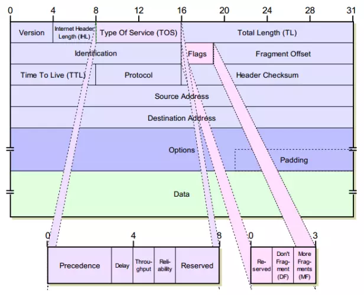
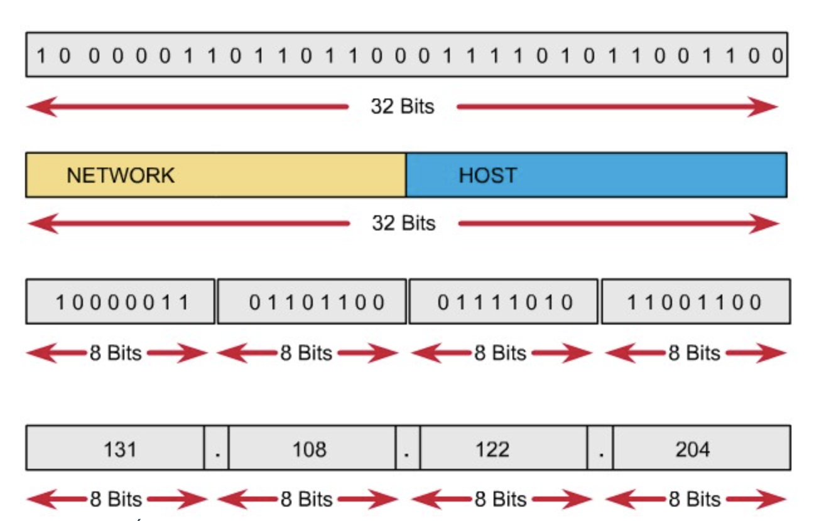
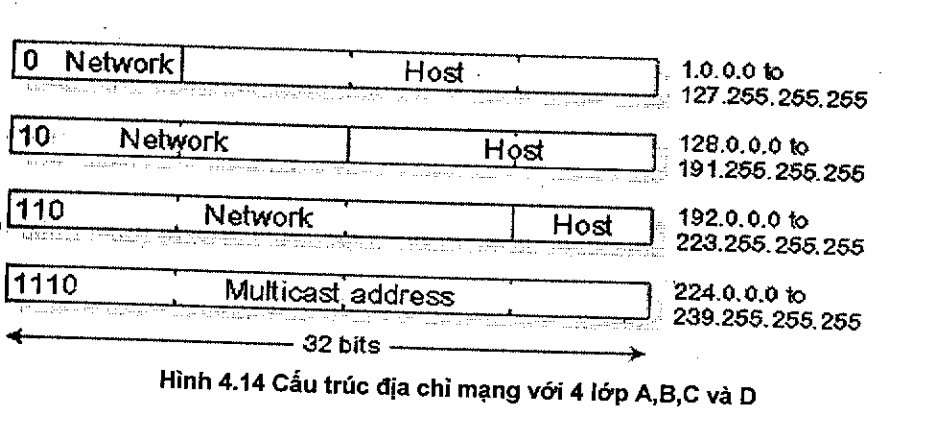
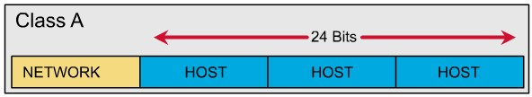
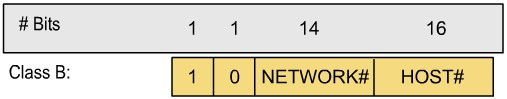
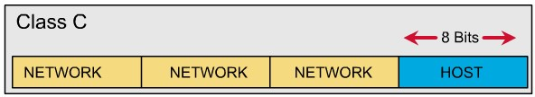
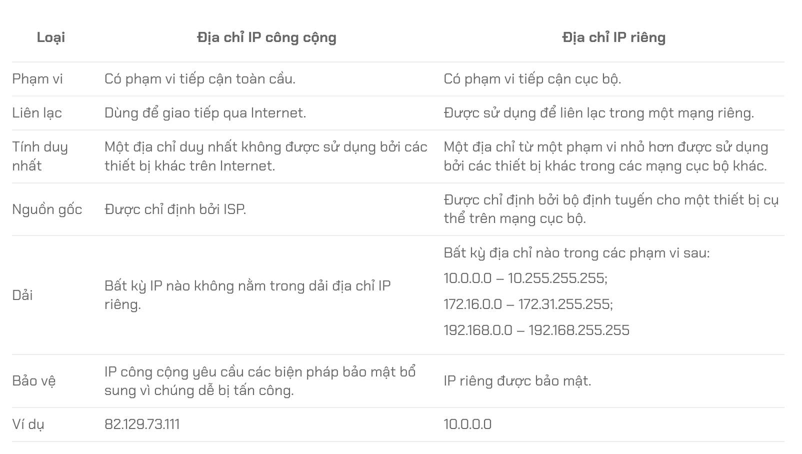
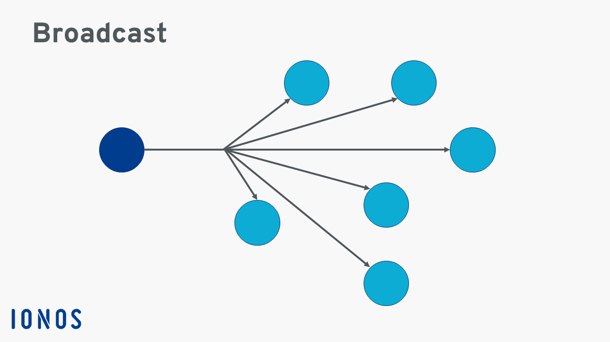
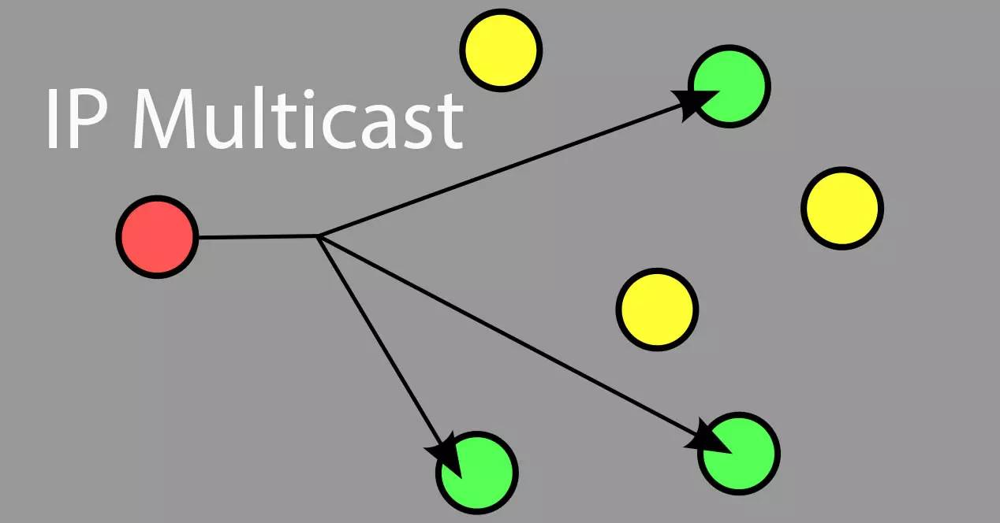
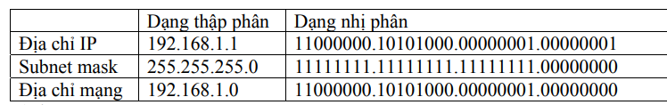

## Tìm hiểu về IPv4

### 1. IPv4 là gì?

- Địa chỉ IP là một dãy số được sử dụng để gắn nhãn cho bất kỳ thiết bị nào sử dụng giao thức Internet Protocol làm phương tiện liên lạc.
- Giao thức Internet Protocol được phát triển vào những năm 1970 và là nền tảng của bộ giao thức trên internet, bộ giao thức mà định nghĩa mọi thứ về cách các thiết bị trên internet trao đổi thông tin.
- IPv4 là phiên bản 4 của giao thức Internet Protocol (IP) và là phiên bản được sử dụng rộng rãi nhất hiện nay.

### 2. Tại sao không có IPv1, IPv2, IPv3, IPv5?

- Trong lịch sử TCP thì phiên bản đầu tiên được thiết kế vào năm 1973 sau khi mạng ARPANET được phát triển. Tuy nhiên, phiên bản này không bao giờ được sử dụng rộng rãi.
- Phiên bản 2 ra đời vào năm 1977, thử nghiệm kết nối 3 mạng lưới giữa Anh, Mỹ và Nauy. Tuy nhiên, phiên bản này cũng không bao giờ được sử dụng rộng rãi.
- IPv3 là một phiên bản khác được phát triển bởi David Clark vào năm 1978, nhưng cũng không bao giờ được sử dụng rộng rãi.
- IPv4 là phiên bản đầu tiên được sử dụng rộng rãi.
- IPv5 là một giao thức khác được phát triển bởi một nhóm nghiên cứu tại AT&T, nhưng không bao giờ được sử dụng rộng rãi. Với IPv5, các nhà khoa học đã cố gắng tạo ra một giao thức mới để giải quyết vấn đề về đa phương tiện,
vì thế IPv5 còn được gọi là ST2 (Stream Protocol Version 2). Tuy nhiên cuối cùng công nghệ này chỉ được dùng để cải tiến băng thông cho IPv4
- IPv6 là phiên bản tiếp theo của IPv4.

### 3. Cấu trúc của gói dữ liệu IPv4



- **Version (4 bits)**: Phiên bản của giao thức IP. Đối với IPv4, giá trị của trường này là 4.
- **Header length (4 bits)**: 4 bit này dùng để xác định vị trí bắt đầu của dữ liệu thực sự trong gói dữ liệu IP. Tuy nhiên phần lớn các gói dữ liệu IP không chứa các trường lựa chọn nên tiêu đề của gói dữ liệu cố định là 20 byte.
- **Type of Service (8 bits)**: Giúp phân biệt các kiểu khác nhau của gói dữ liệu IP, để từ đó có thể xử lý theo những cách khác nhau. Ví dụ: Khi mạng quá tải, cần phân biệt được gói dữ liệu nào quan trọng hơn để xử lý trước.
  - Precedence (3 bit): chỉ thị quyền ưu tiên gửi datagram, cụ thể:
    - 111: Network Control
    - 110: Internetwork Control
    - 101: CRITIC/ECP
    - 100: Flash Override
    - 011: Flash
    - 010: Immediate
    - 001: Priority
    - 000: Routine
  - Delay (1 bit): chỉ thị gói dữ liệu cần được truyền đi nhanh chóng hay không.
  - Throughput (1 bit): chỉ thị gói dữ liệu cần được truyền đi với tốc độ cao hay không.
  - Reliability (1 bit): chỉ thị gói dữ liệu cần được truyền đi với độ tin cậy cao hay không.
  - Reserved (2 bit): dành cho sử dụng trong tương lai.
- **Datagram Length (16 bits)**: Tổng độ dài của gói dữ liệu IP tính theo byte, độ dài trường này là 16 bit tương đương với 65535 byte. Tuy nhiên, hiếm khi kích thước vượt quá 1500 byte.
- **Identification, Flag, Fragmentation**: Được sử dụng để phân mảnh gói dữ liệu IP khi gói dữ liệu quá lớn.
- **Time to Live (8 bits)**: Được sử dụng để đảm bảo gói dữ liệu không thể lưu chuyển mãi mãi trong mạng. Trường này sẽ giảm đi 1 sau mỗi lần gói dữ liệu đi qua một router. Khi trường này giảm về 0, gói dữ liệu sẽ bị loại bỏ.
- **Protocol (8 bits)**: Trường này chỉ được sử dụng khi gói dữ liệu IP đến được máy đích. Trường này xác định giao thức lớp trên mà dữ liệu sẽ được chuyển đến. Giá trị của trường này xác định giao thức lớp trên mà dữ liệu sẽ được chuyển đến. Ví dụ: 6 cho TCP, 17 cho UDP.
- **Header Checksum (16 bits)**: Giúp phát hiện lỗi trong tiêu đề gói dữ liệu IP được gửi đến. Giá trị checksum được tính bằng cách xem phần tiêu đề là một chuỗi các 16 bit, tính tổng của chúng và sau đó lấy bù 1 của tổng đó. Số bù của tổng này là Internet checksum.
- **Source Address và Destination Address (32 bits)**: Địa chỉ IP nguồn và đích của gói dữ liệu.
- **Options (0-40 bits)**: Trường này cho phép mở rộng tiêu đề IP,sự tồn tại của nó làm phức tạp việc xử lý các gói tin vì nó không có độ dài cố định do không xác định được vị trí bắt đầu thực sự. Như vậy thời gian xử lý gói dữ liệu IP tại mỗi router có thể sẽ khác nhau. Đây là nhược điểm của các mạng hiệu suất cao, chính vì vậy IPv6 đã loại bỏ trường này.

### 4. Cấu trúc địa chỉ IPv4



- Địa chỉ IP gồm 32 bit nhị phân, chia thành 4 cụm 8 bit (gọi là các octet). Các octet được biểu diễn dưới dạng thập phân và được ngăn cách nhau bằng các dấu chấm.
- Địa chỉ IP được chia thành hai phần: phần mạng (network) và phần host.
- Việc đặt địa chỉ IP phải tuân theo các quy tắc sau:
  - Các bit phần mạng không được phép đồng thời bằng 0.
    VD: địa chỉ 0.0.0.1 với phần mạng là 0.0.0 và phần host là 1 là không hợp lệ.
  - Nếu các bit phần host đồng thời bằng 0, ta có một địa chỉ mạng.
    VD: địa chỉ 192.168.1.1 là một địa chỉ có thể gán cho host nhưng địa chỉ 192.168.1.0 là một địa chỉ mạng, không thể gán cho host được.
  - Nếu các bit phần host đồng thời bằng 1, ta có một địa chỉ quảng bá (broadcast).
    VD: địa chỉ 192.168.1.255 là một địa chỉ broadcast cho mạng 192.168.1.0

### 5. Các lớp địa chỉ IPv4



- IPv4 được chia thành 5 lớp: A, B, C, D, E. Tuy nhiên lớp E được lưu trữ để sử dụng trong tương lai và không được sử dụng trong thực tế.

#### a. Lớp A



- Địa chỉ lớp A sử dụng một octet đầu làm phần mạng, ba octet sau làm phần host.
- Bit đầu của một địa chỉ lớp A luôn được giữ là **0**. Do đó, các địa chỉ mạng lớp A gồm: 1.0.0.0 à 127.0.0.0.
  Tuy nhiên, mạng 127.0.0.0 được sử dụng làm mạng loopback nên địa chỉ mạng lớp A sử dụng được gồm 1.0.0.0 à 126.0.0.0 (126 mạng).
- Phần host: 24 bit
  Một mạng lớp A có 2^24 – 2 host.

#### b. Lớp B



- Địa chỉ lớp B sử dụng hai octet đầu làm phần mạng, hai octet sau làm phần host.
- Hai bit đầu của một địa chỉ lớp B luôn được giữ là **10**. Do đó các địa chỉ mạng lớp B gồm:
  128.0.0.0 -> 191.255.0.0
  Có tất cả 2^14 mạng trong lớp B.
- Phần host: 16 bit
  Một mạng lớp B có 2^16 – 2 host.

#### c. Lớp C



- Địa chỉ lớp C sử dụng ba octet đầu làm phần mạng, một octet sau làm phần host.
- Ba bit đầu của một địa chỉ lớp C luôn được giữ là **110**. Do đó, các địa chỉ mạng lớp C gồm:
  192.0.0.0 -> 223.255.255.0
  Có tất cả 2^21 mạng trong lớp C.
- Phần host: 8 bit
  Một mạng lớp C có 28 – 2 = 254 host.
- Ví dụ: các địa chỉ 192.168.1.1, 203.162.4.191 là các địa chỉ lớp C.

#### d. Lớp D

- Địa chỉ:
  224.0.0.0 -> 239.255.255.255
- Dùng làm địa chỉ multicast.

#### e. Lớp E

- Từ 240.0.0.0 trở đi.
- Được dùng cho mục đích dự phòng.

**Chú ý**:
Các lớp địa chỉ IP có thể sử dụng để đặt cho các host là các lớp A, B, C.
Để thuận tiện cho việc nhận diện một địa chỉ IP thuộc lớp nào, ta quan sát octet đầu của địa chỉ, nếu octet này có giá trị:

```
1 => 126: địa chỉ lớp A.
128 => 191: địa chỉ lớp B.
192 => 223: địa chỉ lớp C.
224 => 239: địa chỉ lớp D.
240 => 255: địa chỉ lớp E.
```

<!-- Tuy nhiên 4 lớp trên không còn được áp dụng trong cấu trúc địa chỉ IP nữa. Điều kiện phần mạng với độ dài là 1, 2 hoặc 3 byte không hợp lý khi số lượng các tổ chức với mạng cỡ nhỏ hay trung bình ngày càng tăng. Mạng lớp C (/24) chỉ có thể có 2^8 - 2 = 254 máy. Một số lượng quá nhỏ với nhiều tổ chức. Tuy nhiên mạng lớp B (/16) lại quá lớn với 2^16 - 2 = 65534 máy. Điều này dẫn đến việc lãng phí địa chỉ IP. Ví dụ một tổ chức chỉ cần 3000 máy thì sẽ lãng phí 62534 địa chỉ IP trong khi đáng ra có thể phân phối cho các tổ chức khác.

=> CIDR (Classless Inter-Domain Routing) ra đời để giải quyết vấn đề này. CIDR không chia địa chỉ IP theo lớp mà chia theo dải địa chỉ IP. Điều này giúp tận dụng tối đa địa chỉ IP và giảm thiểu lãng phí. -->

### 6. So sánh IP Public và IP Private

- IP Public: Là địa chỉ IP được sử dụng để kết nối với Internet. Địa chỉ IP Public là duy nhất trên toàn thế giới.
- IP Private: Là địa chỉ IP được sử dụng trong mạng nội bộ, không thể truy cập từ Internet. Địa chỉ IP Private được sử dụng để kết nối các máy tính trong mạng nội bộ. Nếu muốn kết nối với Internet, địa chỉ IP Private phải được định tuyến thông qua NAT (Network Address Translation), sau đó thay đổi thành địa chỉ IP Public.

Vì địa chỉ IP riêng không bao giờ rời khỏi mạng LAN, nên các địa chỉ IP riêng không cần phải duy nhất trên toàn thế giới. Điều này có nghĩa là bạn có thể sử dụng cùng một địa chỉ IP riêng trong nhiều mạng LAN khác nhau. Điều này giúp giảm thiểu lãng phí địa chỉ IP.

Mỗi địa chỉ IP riêng thuộc một trong các dải sau:

- Địa chỉ lớp A nằm trong khoảng từ 10.0.0.0 đến 10.255.255.255 và có 8 bit cho mạng và 24 bit cho máy chủ.
- Địa chỉ lớp B nằm trong khoảng từ 172.16.0.0 đến 172.31.255.255 và được sử dụng cho các mạng trung bình. Chúng có 16 bit cho mạng và 16 bit cho máy chủ.
- Địa chỉ lớp C nằm trong khoảng từ 192.168.0.0 đến 192.168.255.255 và có 24 bit cho mạng và 8 bit cho máy chủ.



### 7. So sánh địa chỉ Broadcast và địa chỉ Multicast



- Địa chỉ Broadcast: Được sử dụng để gửi dữ liệu đến tất cả các máy trong mạng. Một địa chỉ Broadcast có thể là địa chỉ IP của mạng hoặc địa chỉ IP của một máy trong mạng.



- Địa chỉ Multicast: Được sử dụng để gửi dữ liệu đến một nhóm máy trong mạng. Nó có tính chọn lọc cao hơn.

### 8. Khái niệm subnet, subnet mask và prefix

- Subnet: Là một phần của mạng lớn được chia nhỏ thành các mạng con nhỏ hơn.

- Subnet mask: Là một dãy số 32 bit được sử dụng để xác định phần mạng và phần máy trong địa chỉ IP. Subnet mask được sử dụng để chia mạng thành các mạng con nhỏ hơn. Subnet mask được biểu diễn dưới dạng dấu chấm thập phân. Ví dụ:



- Prefix: Là một phần của địa chỉ IP được sử dụng để xác định phần mạng. Prefix được biểu diễn dưới dạng /n, trong đó n là số bit của phần mạng. Ví dụ: /21, /24.

## Tài liệu tham khảo

- https://viblo.asia/p/tim-hieu-giao-thuc-ip-phan-1-bJzKmxer59N
