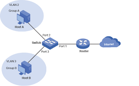
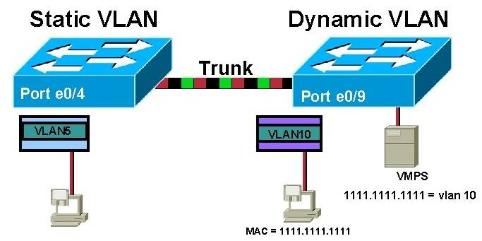
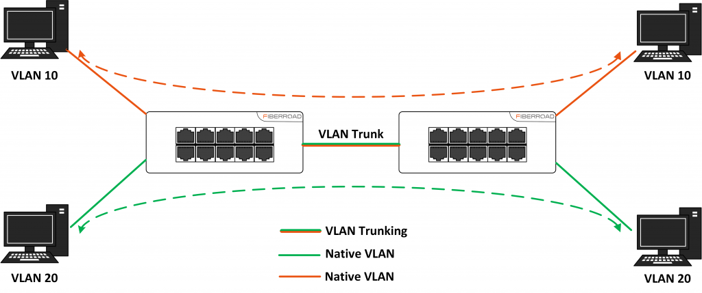

# Tìm hiều về VLAN

## Khái niệm VLAN

- VLAN là viết tắt của "Virtual Local Area Network" – Mạng LAN Ảo.
- VLAN là một công nghệ mạng cho phép phân chia một mạng LAN vật lý thành nhiều mạng LAN logic độc lập.
- Việc này giúp quản lý mạng trở nên dễ dàng hơn, tăng cường bảo mật và giảm bớt lưu lượng mạng không cần thiết.

## Các loại VLAN

- Static VLAN (VLAN tĩnh): Static VLAN được tạo ra bằng cách cách gán các cổng của mỗi Switch thành một mạng VLAN. Mỗi cổng nằm trên một VLAN và chỉ giao tiếp, kết nối với những VLAN được chỉ định.
- Dynamic VLAN (VLAN động): Với một VMPS (VLAN Management Policy Server) có thể đăng ký các cổng cuả switch vào các VLAN một cách tự động dựa trên địa chỉ MAC nguồn của thiết bị được nối vào cổng. Dynamic VLAN hiện thời tính đến thành viên của nó dựa trên địa chỉ MAC của thiết bị. Như một thiết bị trong mạng, nó truy vấn một cơ sở dữ liệu trên VMPS của các VLAN thành viên.

=> Tóm lại: Sự khác biệt giữa Static VLAN và Dynamic VLAN là Static VLAN dựa vào cổng vật lý của switch, trong khi Dynamic VLAN dựa trên đặc tính của thiết bị, thường là địa chỉ MAC.

## Cách hoạt động của VLAN

- ID VLAN: Mỗi VLAN trong mạng được định danh bởi một ID duy nhất, nằm trong khoảng từ 1 đến 4094. ID này giúp switch phân biệt được lưu lượng từ các VLAN khác nhau.
  - 0, 4095: Không được sử dụng.
  - 1 -> 1001: Sử dụng trong các trường hợp bình thường.
  - 1002 -> 1005: Token Ring.
  - 1006 -> 4094: Chỉ được cấu hình trên Transparent Switch.
- Giao Tiếp trong VLAN: Các máy tính hoặc thiết bị (hosts) cùng nằm trong một VLAN có cùng ID VLAN có thể trao đổi dữ liệu với nhau mà không cần đi qua router. Chúng được xem như nằm trong cùng một "phòng" ảo dù có thể cách xa nhau về mặt vật lý.
- Cổng Switch: Mỗi cổng trên switch có thể được cấu hình để thuộc về một VLAN cụ thể. Khi một thiết bị được kết nối vào cổng này, nó sẽ tự động trở thành một phần của VLAN đó.
- Kết nối giữa các Switch: Để cho phép lưu lượng từ cùng một VLAN có thể di chuyển qua nhiều switch, các switch sẽ kết nối với nhau thông qua các cổng trunk. Cổng trunk có thể chuyển tiếp lưu lượng của nhiều VLAN khác nhau.

## Tài liệu tham khảo

- https://vnpro.vn/thu-vien/tong-quan-ve-vlan-cau-hinh-vlan-co-ban-3106.html