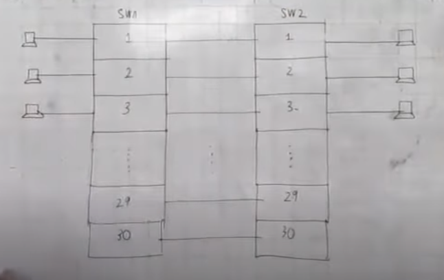

# Tìm hiểu về Trunking, VLAN Trunking

## Tại sao lại cần Trunking

- Để 1 VLAN từ switch này có thể truyền thông tin qua VLAN ở switch kia, ta cần 1 kết nối vật lý từ cổng của VLAN này sang cổng của VLAN kia.
- Nhìn vào hình trên chúng ta có thể thấy để kết nối giữa 2 VLAN thì phải cần 30 kết nối vật lý để các VLAN có thể kết nối với nhau => quá nhiều, không tối ưu.

## VLAN Trunking

- Vậy để kết nối giữa 2 switch để các VLAN có thể giao tiếp với nhau mà chỉ cần dùng 1 dây thì đây chính là Trunking.
- VLAN Trunk là một khái niệm liên quan đến việc truyền tải dữ liệu giữa các VLAN khác nhau thông qua một kết nối vật lý duy nhất.

## Các chuẩn Trunking

- Để truyền các thông tin VLAN vào các frame để truyền sang các VLAN khác thì cần phải truyền theo chuẩn gọi là chuẩn Trunking, có 2 loại chuẩn Trunking phổ biến: Chuẩn DOT1Q hay 802.1q do IEEE đề ra, chuẩn ISL do CISCO đề ra.

### Chuẩn DOT1Q:

- Nó sẽ gán thêm field Tag vào ngay sau field Source MAC.
- EtherType: sử dụng EtherType 0x8100 để cho biết đây là một khung 802.1Q.
- PRI: 3 bit, mang thông tin ưu tiên cho frame.
- Token Ring Encapsulation Flag: chỉ ra giải thích của frame nếu nó được truyền từ Ethernet tới Token Ring.
- VLAN ID: 12 bit, dùng để xác định frame là của VLAN nào.

### Chuẩn ISL:

- DA (Destination address): 40-bit địa chỉ đích.
- Type: 4 bit mô tả của các loại frame: Ethernet (0000), Token Ring (0001), FDDI (0010) và ATM (0011). 
- User: 4 bit để xác định các ưu tiên Ethernet.
- SA (Source address): 48 bit địa chỉ MAC nguồn của cổng truyền trên Switch.
- LEN (Length): 16 bit mô tả độ dài khung khi trừ DA, Type, người sử dụng, SA, LEN, và CRC.
- AAAA03: 24 bit, đây là một hằng số.
- HSA (High bits of source address): 3 byte đầu tiên của SA (ID của nhà sản xuất).
- VID: 15 bit, nhưng chỉ có 10 bit được sử dụng cho 1024 VLAN. Dùng để phân biệt các frame của các VLAN.
- BPDU (Bridge Protocol Data Unit): 1 bit xác định liệu mô tả frame là một spanning tree BPDU. Nó cũng xác định nếu khung đóng gói là một Cisco Discovery Protocol (CDP) hoặc VLAN Trunk Protocol (VTP) frame.
- INDX (index): 16 bit để cho biết chỉ số port nguồn của gói tin mà nó đi ra khỏi Switch. Giá trị 16 bit này được bỏ qua trong các gói tin nhận.
- RES: 16 bit dành riêng cho Token Ring và FDDI frame.

## Tài liệu tham khảo

- https://vnpro.vn/thu-vien/giao-thuc-interswitch-link-trong-cong-trung-ke-2136.html
- https://vnpro.vn/thu-vien/giao-thuc-8021q-trong-cong-trung-ke-2140.html
