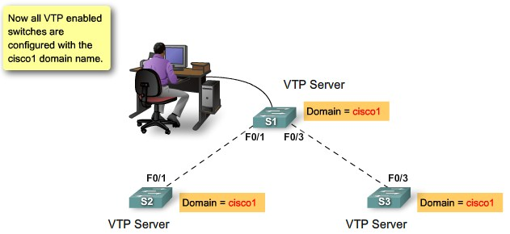

## Tìm hiểu về VTP

### Khái niệm

- VTP viết tắt của từ VLAN Trunking Protocol là giao thức độc quyền của Cisco hoạt động ở lớp 2 của mô hình OSI. VTP giúp cho việc cấu hình VLAN luôn đồng nhất khi thêm, xóa, sửa thông tin về VLAN trong một hệ thống mạng. VTP được thiết lập để giải quyết các vấn đề nằm bên trong hoạt động của môi trường mạng VLAN.
- Giúp đồng bộ cấu hình VLAN trên tất cả các switch.

### VTP Mode

Khi triển khai VTP trên hệ thống, bạn sẽ có ba sự lựa chọn chế độ làm việc cho Switch của mình: Server, Client và Transparent.

- Chế độ sever của VTP: Một switch trong mạng sẽ được mặc định hoạt động ở chế độ Server. Nó sẽ tạo mới VLAN, sửa đổi VLAN, cũng có thể xóa VLAN. Bên cạnh đó, nó sẽ truyền, đồng bộ hóa thông tin VLAN đến các switch khác trong cùng domain.
- Chế độ client của VTP: Ở chế độ này, các switch chỉ truyền và nhận các thông tin quảng bá đến với nhau và tự động cập nhật cấu hình VLAN của nó. Các switch không có quyền xóa hay chỉnh sửa các VLAN. 
- Chế độ Transparent của VTP: Ở chế độ này, switch chỉ quảng bá thông tin Vtp nào nhận ra được cổng trunk của nó. Bởi vậy, nó không đồng bộ hóa thông tin của VLAN. Nó có thể tạo ra, chỉnh sửa và xóa VLAN trên local.

### Cách hoạt động của VTP

1. Gửi bản tin:

VTP Server gửi bản tin VTP cứ 5 phút hoặc khi có thay đổi cấu hình VLAN.
Bản tin VTP chứa thông tin về:
Số lần sửa đổi VLAN (revision)
Tên và số lượng VLAN
Thông tin switch có cổng gán cho mỗi VLAN 

2. Tham gia VTP:

Switch muốn tham gia VTP cần:
Cấu hình revision, VTP domain và VTP password trùng khớp với các switch khác
Cấu hình VLAN ban đầu trên một switch (server) 

3. Cập nhật thông tin:

Switch có revision nhỏ hơn sẽ cập nhật từ switch có revision lớn hơn.
Sau khi cập nhật, revision của tất cả các switch sẽ bằng nhau. 

4. VTP domain và VTP password:

Các switch trong cùng VTP domain mới nhận được cập nhật.
VTP password dùng để xác thực giữa các switch.
