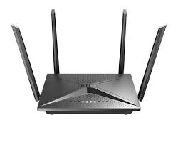
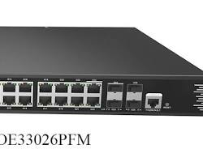
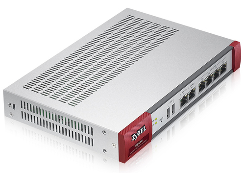
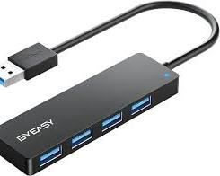

## Tìm hiểu về thiết bị mạng

### 1. Router:

- Là thiết bị kết nối các mạng khác nhau, ví dụ như mạng LAN với Internet.
- Có chức năng định tuyến lưu lượng truy cập giữa các mạng.
- Có thể xử lý các giao thức mạng khác nhau như IP, TCP, UDP.
- Có thể được sử dụng để chia sẻ kết nối Internet cho nhiều thiết bị.

### 2. Switch (L2 và L3):

- Là thiết bị kết nối các thiết bị trong cùng một mạng LAN.
- Switch L2 hoạt động dựa trên địa chỉ MAC để chuyển mạch dữ liệu.
- Switch L3 hoạt động dựa trên địa chỉ IP để chuyển mạch dữ liệu.
- Switch có thể được sử dụng để chia sẻ kết nối Internet cho nhiều thiết bị.

### 3. Firewall:

- Là thiết bị bảo mật mạng bằng cách kiểm soát lưu lượng truy cập ra vào mạng.
- Có thể lọc các gói tin dựa trên địa chỉ IP, cổng TCP/UDP, giao thức mạng.
- Có thể ngăn chặn các truy cập trái phép vào mạng.
- Có thể được sử dụng để bảo vệ mạng khỏi các virus, malware, tấn công mạng.

### 4. Hub:

- Là thiết bị kết nối các thiết bị trong cùng một mạng LAN.
- Hoạt động như một trung tâm để truyền tín hiệu đến tất cả các thiết bị được kết nối.
- Không có khả năng xử lý dữ liệu hay lọc lưu lượng truy cập.
