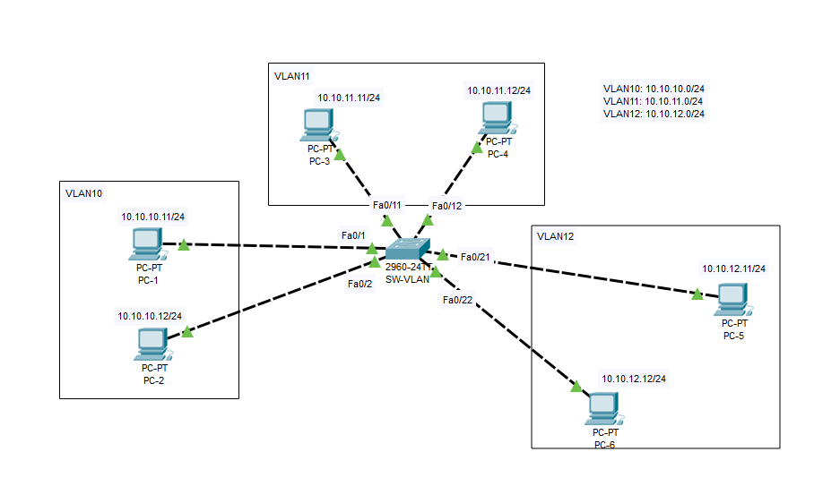

# Cấu hình chia VLAN trên switch



| VLAN | Port           |
| ---- | -------------- |
| 10   | Fa0/1, Fa0/2   |
| 11   | Fa0/11, Fa0/12 |
| 12   | Fa0/21, Fa0/22 |

## Tạo các VLAN10, VLAN11, VLAN12

Tạo VLAN10

```bash
Switch> enable
Switch# configure terminal
Switch(config)# vlan 10
Switch(config-vlan)# name VLAN10
Switch(config-vlan)# exit
```

Tương tự với VLAN11 và VLAN12

Kiểm tra lại các VLAN đã tạo

```bash
Switch# show vlan brief
```

## Gán cổng vào VLAN

- Gán cổng Fa0/1, Fa0/2 vào VLAN10

```bash
Switch> enable
Switch# configure terminal
Switch(config)# interface fa0/1
Switch(config-if)# switchport mode access
Switch(config-if)# switchport access vlan 10
Switch(config-if)# exit
Switch(config)# interface fa0/2
Switch(config-if)# switchport mode access
Switch(config-if)# switchport access vlan 10
Switch(config-if)# exit
```

- Gán cổng Fa0/11, Fa0/12 vào VLAN11

```bash
Switch> enable
Switch# configure terminal
Switch(config)# interface fa0/11
Switch(config-if)# switchport mode access
Switch(config-if)# switchport access vlan 11
Switch(config-if)# exit
Switch(config)# interface fa0/12
Switch(config-if)# switchport mode access
Switch(config-if)# switchport access vlan 11
Switch(config-if)# exit
```

- Gán cổng Fa0/21, Fa0/22 vào VLAN12

```bash
Switch> enable
Switch# configure terminal
Switch(config)# interface fa0/21
Switch(config-if)# switchport mode access
Switch(config-if)# switchport access vlan 12
Switch(config-if)# exit
Switch(config)# interface fa0/22
Switch(config-if)# switchport mode access   
Switch(config-if)# switchport access vlan 12
Switch(config-if)# exit
```