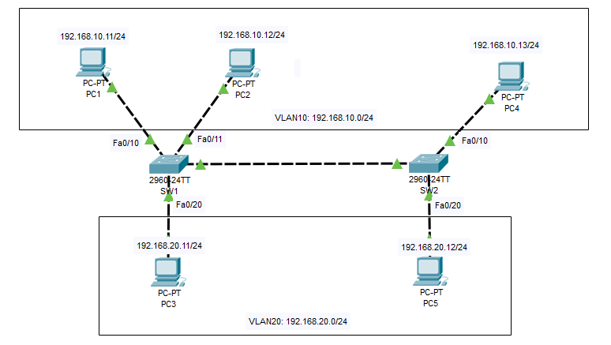

# Cấu hình VTP domain



**Quy hoạch VLAN:**

<table border="1">
    <tr>
        <th colspan="2" style="text-align:center;">VLAN</th>
    </tr>
    <tr>
        <th>VLAN10</th>
        <th>192.168.10.0/24 </th>
    </tr>
    <tr>
        <th>VLAN20</th>
        <th>192.168.20.0/24 </th>
    </tr>
</table>

**Quy hoạch IP:**

<table border="1">
  <tr>
    <th>Switch</th>
    <th>VLAN</th>
    <th>Tên PC</th>
    <th>IP</th>
    <th>Port kết nối trên Switch</th>
  </tr>
  <tr>
    <th rowspan="3" style="text-align:center;">SW1</th>
    <th rowspan="2" style="text-align:center;">10</th>
    <th>PC1</th>
    <th>192.168.10.11</th>
    <th>Fa0/10</th>
  </tr>
  <tr>
    <th>PC2</th>
    <th>192.168.10.12</th>
    <th>Fa0/11</th>
  </tr>
  <tr>
    <th style="text-align:center; vertical-align:middle;">20</th>
    <th>PC3</th>
    <th>192.168.20.11</th>
    <th>Fa0/20</th>
  </tr>
  <tr>
    <th rowspan="2" style="text-align:center;">SW2</th>
    <th style="text-align:center;">10</th>
    <th>PC4</th>
    <th>192.168.10.13</th>
    <th>Fa0/10</th>
  </tr>
    <tr>
        <th style="text-align:center;">20</th>
        <th>PC5</th>
        <th>192.168.20.12</th>
        <th>Fa0/20</th>
    </tr>
</table>

## 1. Thiết lập VLAN trên SW1

### Tạo 2 VLAN trên SW1

```bash
SW1(config)#vlan 10
SW1(config-vlan)#name VLAN10
SW1(config-vlan)#exit
SW1(config)#vlan 20
SW1(config-vlan)#name VLAN20
SW1(config-vlan)#exit
```

### Gắn các port vào VLAN tương ứng

```bash
SW1(config)#interface FastEthernet0/10
SW1(config-if)#switchport mode access
SW1(config-if)#switchport access vlan 10
SW1(config-if)#exit
SW1(config)#interface FastEthernet0/11
SW1(config-if)#switchport mode access
SW1(config-if)#switchport access vlan 10
SW1(config-if)#exit
SW1(config)#interface FastEthernet0/20
SW1(config-if)#switchport mode access
SW1(config-if)#switchport access vlan 20
SW1(config-if)#exit
```

### Kiểm tra cấu hình

```bash
SW1#show vlan brief
```

## 2. Thiết lập VLAN trên SW2

Tương tự như SW1

## 3. Cấu hình VTP

Đặt IP cho VLAN10 là 192.168.10.1 và VLAN20 là 192.168.20.1 trên SW1.

```bash
SW1(config)#interface vlan 10
SW1(config-if)#ip address 192.168.10.1 255.255.255.0
SW1(config-if)#no shutdown
SW1(config-if)#exit

SW1(config)#interface vlan 20
SW1(config-if)#ip address 192.168.20.1 255.255.255.0
SW1(config-if)#no shutdown
SW1(config-if)#exit
```

Tương tự như SW1, đặt IP cho VLAN10 là 192.168.10.2 và VLAN20 là 192.168.20.2 trên SW2.

## 4. Thiết lập VTP

Ta sẽ thiết lập: SW1 là server, SW2 là client. **VTP domain** sẽ là `CCNA`. **VTP password** sẽ là `cisco123`.

### Cấu hình SW1

```bash
SW1(config)#vtp mode server
SW1(config)#vtp domain CCNA
SW1(config)#vtp password cisco123
```

### Cấu hình SW2

```bash
SW2(config)#vtp mode client
SW2(config)#vtp domain CCNA
SW2(config)#vtp password cisco123
```

### Tạo đường trunking giữa SW1 và SW2

```bash
SW1(config)#interface FastEthernet0/1
SW1(config-if)#switchport mode trunk
```

```bash
SW2(config)#interface FastEthernet0/1
SW2(config-if)#switchport mode trunk
```

## 5. Kiểm tra

Các lệnh để kiểm tra.

```bash
show vtp status (để kiểm tra xem switch có phải là server hay client không)
show vtp password (để kiểm tra password)
show interfaces trunk (để kiểm tra các trunk port xem đã được cấu hình chưa)
```

