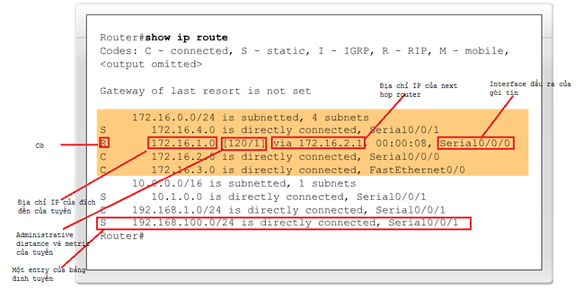
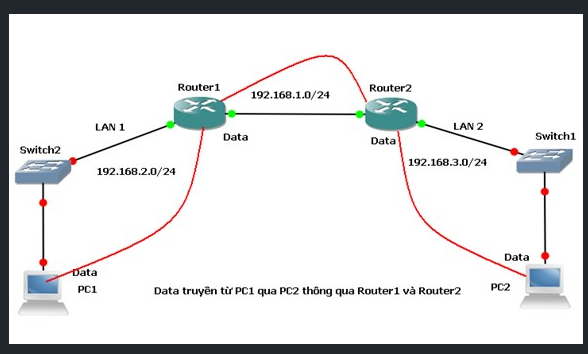

# Tìm hiểu về Routing

## 1. Tìm hiểu về Routing


- **Routing** là quá trình chuyển tiếp gói tin từ một mạng đến một mạng khác thông qua các thiết bị định tuyến (router).
- **Router** là thiết bị mạng có khả năng chuyển tiếp gói tin giữa các mạng khác nhau.
- Để định tuyến thì router cần phải:
  - Địa chỉ IP của mạng đích.
  - Xác định được source mà từ đó router có thể học được đường đi đến mạng đích.
  - Những đường đi có thể chọn để chuyển tiếp gói tin đến mạng đích.
  - Chọn đường đi tốt nhất để chuyển tiếp gói tin.

### Cấu tạo bảng định tuyến



- **Routing table** là bảng định tuyến, chứa thông tin về các mạng mà router biết và cách để chuyển tiếp gói tin đến các mạng đó.
- Một bảng định tuyến bao gồm các cột sau:
  - Địa chỉ IP đích (destination IP): Địa chỉ này có thể là địa chỉ của một host cụ thể, hoặc là một địa chỉ của một mạng. Nếu là địa chỉ host, entry này sẽ có host-ID khác 0 để nhận diện một host. Nếu là địa chỉ mạng, phần host-ID = 0.
  - Địa chỉ IP của next-hop router (next-hop IP), hoặc địa chỉ của một mạng kết nối trực tiếp (directly connected IP address): Là địa chỉ của đích đến tiếp theo (router) có thể chuyển tiếp gói tin đến đích.
  - Network interface: Là cổng của router được sử dụng để gửi gói tin đến next-hop.
  - Cờ (flags): Cho biết nguồn cập nhật của tuyến (route). Ví dụ: S – Static Route, C – Connected Route, O – OSPF Route, E – EIGRP Route, I – IGRP Route, R – RIP Route.
  - Metric: Là thông tin về metric của một tuyến đường, thể hiện “khoảng cách” từ router hiện tại đến destination IP. Giá trị này chỉ có ý nghĩa so sánh khi các route sử dụng cùng một giao thức định tuyến.
  - Administrative Distance (AD): Tham số ưu tiên mà người quản trị đặt cho các tuyến trong bảng định tuyến, được gán cho các giao thức. Nếu tuyến được cập nhật từ giao thức, nó sẽ mang giá trị AD của giao thức đó. Giá trị này nằm trong khoảng từ 0 đến 255, càng bé càng ưu tiên. 255 có nghĩa là tuyến không bao giờ được sử dụng.

## 2. Tìm hiểu Static routing

- Static Routing là phương thức định tuyến mà người quản trị sẽ nhập tất cả thông tin về đường đi cho router. Các thông tin này sẽ được nhập vào bảng định tuyến của router.
- Static Routing thường được sử dụng trong các mạng nhỏ, không thay đổi nhiều, hoặc trong các trường hợp cần chuyển tiếp gói tin đến một mạng cụ thể.

## 3. Lab Static routing

- Trong lab này, chúng ta sẽ thực hành cấu hình Static Routing trên router.



- Bước 1: Cấu hình IP cho các interface của router.

Ta truy cập vào router bằng cổng console hoặc telnet, sau đó chúng ta sẽ vào chế độ cấu hình bằng lệnh `configure terminal`.

```bash
Router> enable
Router# configure terminal
Router(config)#
```

Sau đó, ta sẽ cấu hình IP cho các interface của router bằng lệnh `interface` và `ip address`.

```bash
Router(config)# interface gigabitethernet 0/0
Router(config-if)# ip address 192.168.2.2 255.255.255.0
Router(config-if)# no shutdown
Router(config-if)# exit
```

```bash
Router(config)# interface gigabitethernet 0/1
Router(config-if)# ip address 192.168.1.2 255.255.255.0
Router(config-if)# no shutdown
Router(config-if)# exit
```

Buớc 2: Cấu hình Static Routing.

Ta sẽ cấu hình Static Routing để router1 cỏ thể chuyển gói tin đến router2.

```bash
Router(config)# ip route 192.168.3.0 255.255.255.0 192.168.1.2
```

Sau đó, ta kiểm tra lại cấu hình bằng lệnh `show ip route`.

```bash
Router(config)# do show ip route
```

Cuối cùng, ta ping thử từ PC1 sang PC2 để kiểm tra kết nối.
