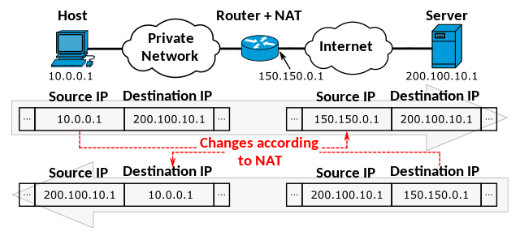
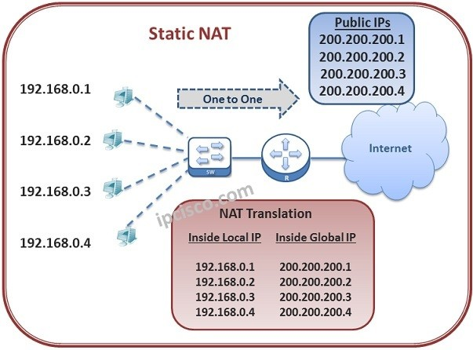
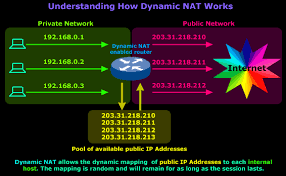
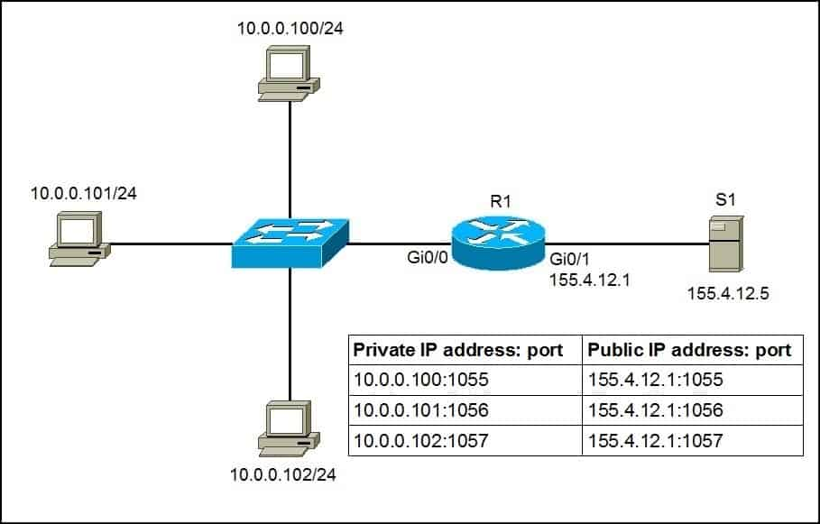
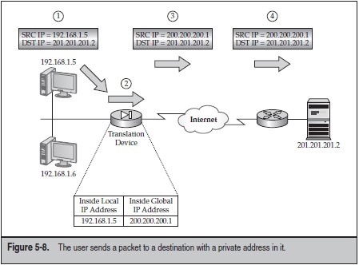
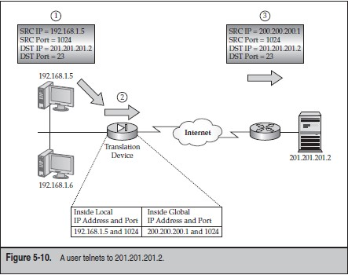
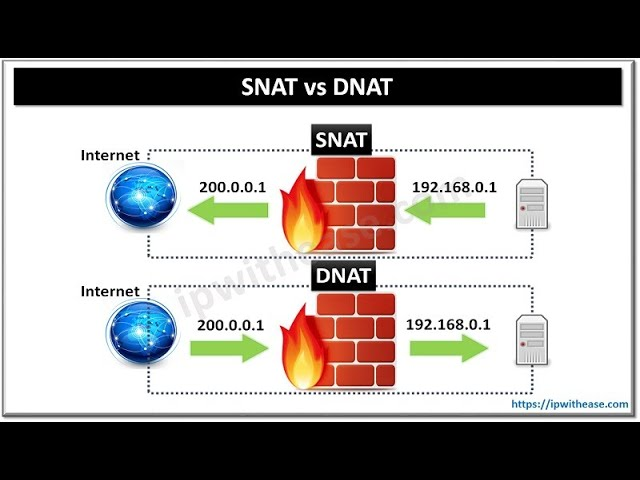

# Giới thiệu về NAT

## 1. Tổng quan về NAT

- Có 2 không gian IP chính: Public IP và Private IP. Private IP là IP được sử dụng trong mạng LAN, mạng nội bộ và được sử dụng lại nhiều lần. Public IP là IP được sử dụng trên Internet và không thể sử dụng lại nhiều lần.
- Các địa chỉ IP private không thể truy cập được vào vùng public (môi trường Internet). Để IP private có thể truy cập được vào Internet, cần phải sử dụng 1 kỹ thuật chuyển đổi địa chỉ IP gọi là NAT (Network Address Translation).

## 2. Các kỹ thuật NAT

### 2.1. Static NAT

- Static NAT là kỹ thuật dùng để thay đổi, biến một IP này thành một IP khác. Bằng cách sử dụng phương pháp cố định cụ thể từ địa chỉ IP cục bộ sang Public. Toàn bộ quá trình này được thực hiện và cài đặt thủ công.

### 2.2. Dynamic NAT

- Dynamic NAT là kỹ thuật NAT mà địa chỉ IP private được chuyển đổi sang địa chỉ IP public một cách tự động.
- Giống như Static NAT, Dynamic NAT cũng sử dụng một bảng NAT để lưu trữ thông tin về việc chuyển đổi địa chỉ IP. Tuy nhiên, Dynamic NAT sử dụng một pool các địa chỉ IP public để chuyển đổi địa chỉ IP private.

### 2.3. PAT (Port Address Translation)

- Static NAT và Dynamic NAT đều sử dụng một địa chỉ IP public để chuyển đổi địa chỉ IP private. Điều này dẫn đến việc số lượng máy tính trong mạng private không thể vượt quá số lượng địa chỉ IP public. Để giải quyết vấn đề này, PAT (Port Address Translation) được phát triển.
- PAT cho phép nhiều máy tính trong mạng private sử dụng cùng một địa chỉ IP public để truy cập Internet. Để phân biệt các kết nối từ các máy tính khác nhau, PAT sử dụng thông tin về cổng (port) để phân biệt.

## 3. Cách hoạt động của NAT

### 3.1. Static NAT và Dynamic NAT (One to One)

- Firewall nhận gói tin từ 192.168.1.5 và quyết định xem nó có cần thực hiện NAT hay không và chuyển tiếp gói tin tới đích. Firewall nhận thấy gói tin đến nó và so sánh với rule NAT. Bởi vì gói tin trùng với rule trong chính sách NAT, Firewall sẽ dịch chuyển địa chỉ nguồn trong gói tin từ 192.168.1.5 thành 200.200.200.1, đây là địa chỉ IP public.

### 3.2. PAT (Many to One)

- Firewall nhận gói tin và nó so sánh thông tin của gói tin với chính sách NAT và quyết định xem nó có cần thực hiện NAT hay không. Do nó trùng với chính sách vì thế firewall thực hiện việc NAT và thay đổi địa chỉ private 192.168.1.5 thành 200.200.200.1. Trong trường hợp này, thông số port nguôn là 1024 không được sử dụng trong bảng NAT nên nó vấn được giữ nguyên mà không thay đổi số Port.

## 4. DNAT (Destination NAT) và SNAT (Source NAT)

- DNAT (Destination NAT) là kỹ thuật NAT mà địa chỉ IP đích được chuyển đổi từ địa chỉ IP public sang địa chỉ IP private. Kỹ thuật này thường được sử dụng để chuyển hướng các kết nối đến một dịch vụ cụ thể trên một máy chủ trong mạng private.

- SNAT (Source NAT) là kỹ thuật NAT mà địa chỉ IP nguồn được chuyển đổi từ địa chỉ IP private sang địa chỉ IP public. Kỹ thuật này thường được sử dụng để ẩn địa chỉ IP private của một máy tính trong mạng private khi truy cập Internet.

# Tài liệu tham khảo

- https://cloud.z.com/vn/news/nat/
- https://vnpro.vn/thu-vien/gioi-thieu-nat-va-pat-tren-asa-2339.html