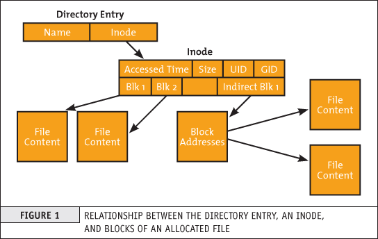
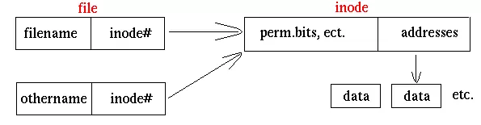
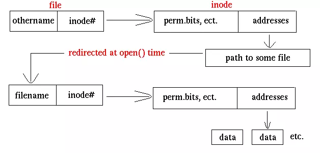

# Định danh các tệp (Applications Location)

- Các chương trình và packages có thể được cài đặt trong nhiều thư mục khác nhau trên hệ thống. Để tìm vị trí của một chương trình hoặc package, bạn có thể sử dụng lệnh `which` hoặc `whereis`. Ví dụ:

  ```
  $ which diff
  /usr/bin/diff
  ```

  Nếu `which` không tìm thấy chương trình, `whereis` là một lựa chọn tốt vì nó tìm kiếm các packages trong một loạt các thư mục hệ thống rộng hơn:

  ```
  $ whereis diff
  diff: /usr/bin/diff /usr/share (Cái này nghĩa là tìm thấy 2 thư mục chứa file diff)
  ```

# Truy cập thư mục (Accessing Directories)

- Để truy cập vào thư mục root, bạn có thể sử dụng lệnh `cd /`

- Để trở lại thư mục trước đó, bạn có thể sử dụng lệnh `cd -`

- Để truy cập vào thư mục cha, bạn có thể sử dụng lệnh `cd ..`

- Để trở lại thư mục home của bạn, bạn có thể sử dụng lệnh `cd` mà không có tham số

- Để truy cập vào thư mục home của một người dùng khác, bạn có thể sử dụng lệnh `cd /home/username` (Nếu bạn có quyền truy cập)

# Khám phá thư mục (Exploring File Systems)

- Để xem nội dung của một thư mục, bạn có thể sử dụng lệnh `ls`. Ví dụ:

  ```
  $ ls
  Desktop  Documents  Downloads  Music  Pictures  Public  Templates  Videos
  ```

- Để xem nội dung của một thư mục (có cả file bị ẩn), bạn có thể sử dụng lệnh `ls -a`. Ví dụ:

  ```
  $ ls -a
  .  ..  .bash_history  .bash_logout  .bashrc  Desktop  Documents  Downloads  Music  Pictures  Public  Templates  Videos
  ```

- Để xem thông tin chi tiết của các file và thư mục, bạn có thể sử dụng lệnh `ls -l`. Ví dụ:

  ```
  $ ls -l
  total 76
  drwxr-xr-x 2 tungnt tungnt 4096 Mar  1 10:00 Desktop
  drwxr-xr-x 2 tungnt tungnt 4096 Mar  1 10:00 Documents
  drwxr-xr-x 2 tungnt tungnt 4096 Mar  1 10:00 Downloads
  drwxr-xr-x 2 tungnt tungnt 4096 Mar  1 10:00 Music
  drwxr-xr-x 2 tungnt tungnt 4096 Mar  1 10:00 Pictures
  drwxr-xr-x 2 tungnt tungnt 4096 Mar  1 10:00 Public
  drwxr-xr-x 2 tungnt tungnt 4096 Mar  1 10:00 Templates
  drwxr-xr-x 2 tungnt tungnt 4096 Mar  1 10:00 Videos
  ```

- Để xem cấu trúc thư mục dưới dạng cây, bạn có thể sử dụng lệnh `tree`. Ví dụ:

  ```
  $ tree
  .
  |── Desktop
  ├── Documents
  ├── Downloads
  ├── Music
  ├── Pictures
  ├── Public
  ├── Templates
  └── Videos

  0 directories, 8 files
  ```

- Để xem cấu trúc thư mục dưới dạng cây (có cả file bị ẩn), bạn có thể sử dụng lệnh `tree -a`. Ví dụ:

  ```
  $ tree -a
  .
  ├── .
  ├── ..
  ├── .bash_history
  ├── .bash_logout
  ├── .bashrc
  ├── Desktop
  ├── Documents
  ├── Downloads
  ├── Music
  ├── Pictures
  ├── Public
  ├── Templates
  └── Videos

  0 directories, 12 files
  ```

# Liên kết cứng và liên kết mềm (Hard Links and Symbolic Links)

## Inode

- Inode là một cấu trúc dữ liệu trong filesystem mà chứa thông tin về một file hoặc thư mục như permissions, owner, group, size, timestamps, và pointers đến các block dữ liệu. Mỗi file hoặc thư mục có một inode duy nhất.



## Liên kết cứng và liên kết mềm

### Liên kết cứng

- Liên kết cứng (hard links) là một cách để tạo một liên kết đến một file. Liên kết cứng không thể tạo cho thư mục và chỉ có thể tạo liên kết cứng cho file ở trên cùng một filesystem. Ví dụ:

  ```
  $ ln file1 file2
  ```

  

- Khi nội dung của file1 thay đổi, file2 cũng thay đổi theo vì cả hai file đều trỏ đến cùng một inode.

### Liên kết mềm

- Liên kết mềm (symbolic links) là một cách để tạo một liên kết đến một file hoặc thư mục. Liên kết mềm có thể tạo cho thư mục và có thể tạo liên kết mềm cho file ở trên các filesystem khác nhau. Ví dụ:

  ```
  $ ln -s file1 file2
  ```

  

- Khác biệt so với Hard Link là Symbolic Link chỉ tham chiếu tới thư mục trừu tường mà không phải địa chỉ vật lý, chúng có inode riêng biệt.

## So sánh giữa liên kết cứng và liên kết mềm

| Liên kết cứng                                                    | Liên kết mềm                                                     |
| ---------------------------------------------------------------- | ---------------------------------------------------------------- |
| Không thể tạo cho thư mục                                        | Có thể tạo cho thư mục                                           |
| Chỉ có thể tạo liên kết cứng cho file ở trên cùng một filesystem | Có thể tạo liên kết mềm cho file ở trên các filesystem khác nhau |
| Khi thay đổi đường dẫn gốc, liên kết cứng vẫn hoạt động          | Khi thay đổi đường dẫn gốc, liên kết mềm không hoạt động         |

# Tài liệu tham khảo

- https://viblo.asia/p/hard-links-va-symbolic-links-tren-linux-07LKXJR2lV4