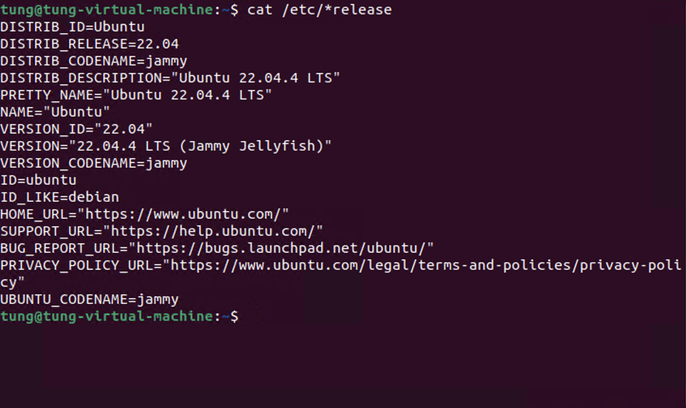
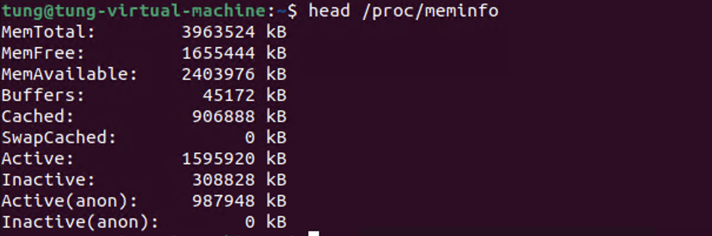

## Phiên bản và phân phối Linux

- Lệnh `cat /etc/*release` hiển thị thông tin phiên bản và phân phối Linux.



- NAME: Tên phân phối Linux.
- VERSION: Phiên bản của phân phối.
- ID: Tên phân phối Linux.
- ID_LIKE: Tên phân phối mà phân phối này dựa trên.
- VERSION_ID: Phiên bản của phân phối.
- HOME_URL: Trang chủ của phân phối.
- PRETTY_NAME: Tên đẹp của phân phối.
- BUG_REPORT_URL: URL báo cáo lỗi của phân phối.

## Kernel Version (Phiên bản Kernel)

- Lệnh `uname -r` hiển thị phiên bản kernel.

``` bash
uname -r
6.5.0-41-generic
```

## Memory Info (Thông tin Bộ nhớ)

- Lệnh `head /proc/meminfo` hiển thị thông tin về bộ nhớ.

 