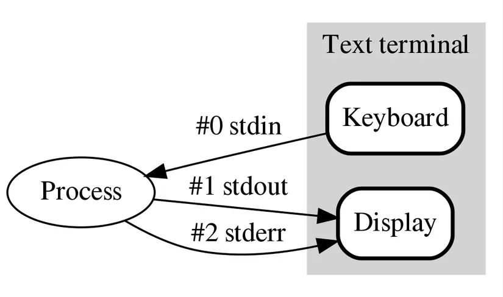
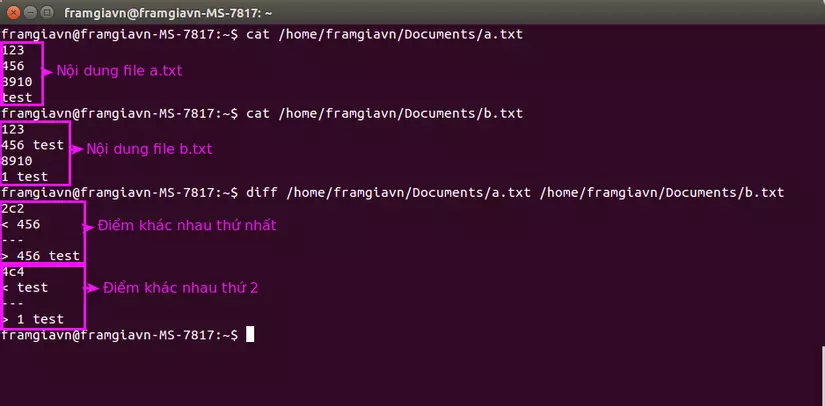

# File Descriptor

- Mỗi file được mở bởi một tiến trình thông qua một file descriptor. File descriptor là một số nguyên không âm, thường là một số nguyên dương. File descriptor thường được gán cho file mở đầu tiên là 0, file mở thứ hai là 1, file mở thứ ba là 2. File descriptor 0, 1, 2 được gọi là standard input, standard output, và standard error tương ứng.



- Khi một tiến trình được tạo ra, nó sẽ mở ba file descriptor 0, 1, 2 cho standard input, standard output, và standard error. Nếu không có gì được chỉ định, standard input sẽ là bàn phím, standard output và standard error sẽ là terminal.

# Redirecting Standard Input, Output, and Error

- Chúng ta có thể redirect standard input, output, và error bằng cách sử dụng các toán tử sau:

  - `>`: redirect standard output (Dùng để ghi đè nội dung file, nếu file không tồn tại sẽ tạo mới)
  - `<`: redirect standard input (Dùng để đọc nội dung file, đưa vào command)
  - `|`: pipe (Dùng để chuyển output của command này thành input của command khác)

- Ví dụ:

  - Để đọc nội dung từ file `input.txt` và đưa vào command `command`, ta sử dụng:

    ```bash
    $ command < input.txt
    ```

  - Để ghi output của command `command` vào file `output.txt`, ta sử dụng:

    ```bash
    $ command > output.txt
    ```

  - Để chuyển output của command `command1` thành input của command `command2`, ta sử dụng:

    ```bash
    $ command1 | command2
    ```

# Searching for Files (Tìm kiếm file)

- Công cụ `locate`: Công cụ `locate` thực hiện tìm kiếm thông qua một cơ sở dữ liệu được tạo trước về các file và thư mục trên hệ thống của bạn, khớp với tất cả các mục chứa một chuỗi ký tự cụ thể.

  ```bash
  # locate zip (Tìm kiếm tất cả các file và thư mục chứa chuỗi "zip")
  ```

- Công cụ `grep`: Công cụ `grep` được sử dụng như một bộ lọc. Nó sẽ in ra chỉ các dòng chứa một hoặc nhiều chuỗi cụ thể.

  ```bash
    $ locate zip | grep bin (Tìm kiếm tất cả các file và thư mục chứa cả "zip" và "bin")
  ```

- Wildcards: Wildcards có thể được sử dụng trong tìm kiếm tên file chứa các ký tự cụ thể.

  | Wildcards | Kết quả                                             |
  | --------- | --------------------------------------------------- |
  | ?         | Khớp với bất kỳ ký tự đơn nào                       |
  | \*        | Khớp với bất kỳ chuỗi ký tự nào                     |
  | [set]     | Khớp với bất kỳ ký tự không nằm trong tập hợp ký tự |
  | [!set]    | Khớp với bất kỳ ký tự không nằm trong tập hợp ký tự |

  Ví dụ:

  ```bash
  $ find /var -name *.log (Tìm kiếm tất cả các file có đuôi `.log` trong thư mục `/var`)
  $ find /var -name ??.log (Tìm kiếm tất cả các file có tên 2 ký tự và đuôi `.log` trong thư mục `/var`)
  $ find /var -name [!a-z]*.log (Tìm kiếm tất cả các file có tên không bắt đầu bằng ký tự từ `a` đến `z` và đuôi `.log` trong thư mục `/var`)
  ```

- Find: Công cụ `find` được sử dụng để tìm kiếm file và thư mục dựa trên một số tiêu chí nhất định.

  - TÌm kiếm thư mục trên một điều kiện cụ thể:

  ```bash
  $ find /var -name *.log (Tìm kiếm tất cả các file có đuôi `.log` trong thư mục `/var`)
  $ find /var -name ??.log (Tìm kiếm tất cả các file có tên 2 ký tự và đuôi `.log` trong thư mục `/var`)
  ```

  - Tìm kiếm file dựa trên kích thước:

  ```bash
  $ find /var -size +10M (Tìm kiếm tất cả các file có kích thước lớn hơn 10MB trong thư mục `/var`)
  ```

  - Tìm kiếm file dựa trên ngày tạo:

  ```bash
  $ find /var -mtime -1 (Tìm kiếm tất cả các file được tạo trong vòng 1 ngày trong thư mục `/var`)
  $ find /var -ctime -1 (Tìm kiếm tất cả các file được thay đổi trong vòng 1 ngày trong thư mục `/var`)
  ```

  - Tìm kiếm file dựa trên quyền sở hữu:

  ```bash
  $ find /var -user tungnt (Tìm kiếm tất cả các file thuộc sở hữu của user `tungnt` trong thư mục `/var`)
  ```

# Managing File (Quản lý file)

## Xem tệp tin

- `cat`: Hiển thị nội dung của file.
- `tac`: Hiển thị nội dung của file theo chiều ngược lại.
- `more`: Hiển thị nội dung của file một trang một trang.
- `less`: Hiển thị nội dung của file một trang một trang, nhưng có thể cuộn lên và xuống.
- `head`: Hiển thị nội dung của file từ đầu file.
- `tail`: Hiển thị nội dung của file từ cuối file.

## Lệnh touch

- `touch`: Tạo file mới hoặc cập nhật thời gian truy cập và thời gian sửa đổi của file.

  ```bash
  $ touch file.txt
  $ touch -t 202108011200 file.txt (Cập nhật thời gian truy cập và thời gian sửa đổi của file thành 12:00 ngày 01/08/2021)
  ```

## Lệnh mkdir và rmdir

- `mkdir`: Tạo thư mục mới.

  ```bash
  $ mkdir dir (Tạo thư mục `dir`)
  ```

- `rmdir`: Xóa thư mục. Lưu ý rằng thư mục phải trống mới xóa được.

  ```bash
  $ rmdir dir (Xóa thư mục `dir`)
  ```

## Lệnh diff

- `diff`: So sánh nội dung của hai file. So sánh sẽ được thực hiện dòng cuối cùng của file 1 với dòng cuối cùng của file 2, dòng thứ hai cuối cùng của file 1 với dòng thứ hai cuối cùng của file 2, và cứ như vậy cho đến khi tìm ra sự khác biệt.



## Lệnh file

- `file`: Xác định loại file.

  ```bash
  $ file file.txt (Xác định loại file `file.txt`)
  ```

# Tài liệu tham khảo

- https://viblo.asia/p/gioi-thieu-cac-cong-cu-so-sanh-files-diff-danh-cho-linuxubuntu-tot-nhat-3P0lPO0pZox
- https://viblo.asia/p/lpic-1-chuong-1-kham-pha-command-line-tren-linux-phan-2-stream-redirect-va-pipe-trong-linux-WAyK8dvWKxX