# 1. Linux là gì?

Linux là một hệ điều hành mã nguồn mở, được phát triển dựa trên Unix. Linux được phát triển bởi Linus Torvalds vào năm 1991. Linux là một hệ điều hành đa nhiệm, đa người dùng và đa nhiệm. Linux là một hệ điều hành miễn phí, có thể sử dụng, sao chép, phân phối và sửa đổi mã nguồn mà không cần phải trả bất kỳ chi phí nào.

# 2. Cấu trúc file. thư mục trong Linux

## 2.1. Cấu trúc thư mục hệ thống tệp Linux

Linux sử dụng cấu trúc thư mục hệ thống tệp. Cấu trúc thư mục hệ thống tệp Linux bắt đầu từ thư mục gốc (`/`). Danh sách thư mục trong linux được tạo ra theo chuẩn FHS (Filesystem Hierarchy Standard). Hiện nay chuẩn này được duy trì bởi Linux Foundation. Xem chi tiết tại: https://refspecs.linuxfoundation.org/fhs.shtml

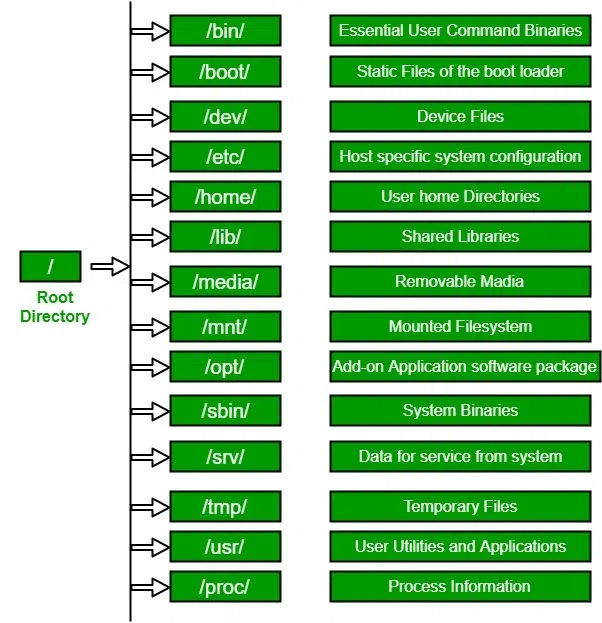

### 1. / (Root):

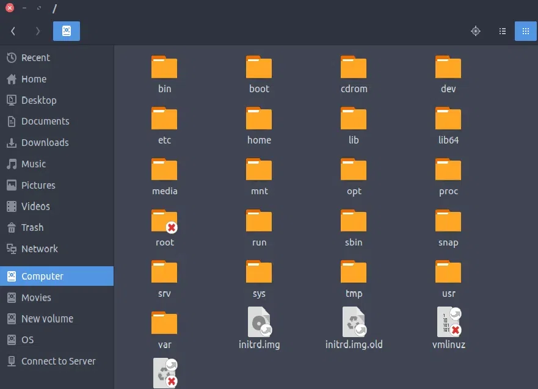

- Đây là thư mục gốc (root) cho toàn bộ hệ thống file.
- Tất cả các file và thư mục khác đều xuất phát từ đây.
- Chỉ người dùng root mới có quyền ghi trong thư mục này.
- /root là thư mục home riêng biệt của người dùng root.

### 2. /bin:

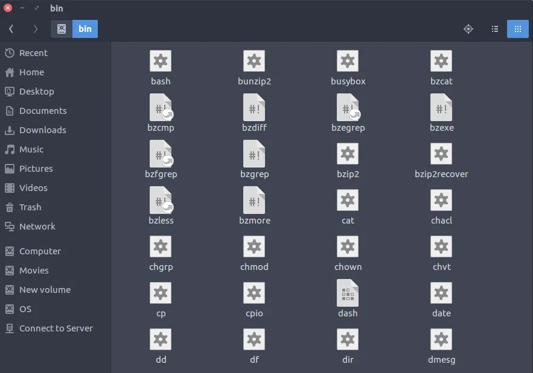

- Chứa các file thực thi lệnh thiết yếu mà hệ thống cần trong chế độ người dùng đơn (single-user mode).
- Lưu các lệnh cần thiết cho tất cả người dùng như cat, ls, cp, ...

### 3. /boot:

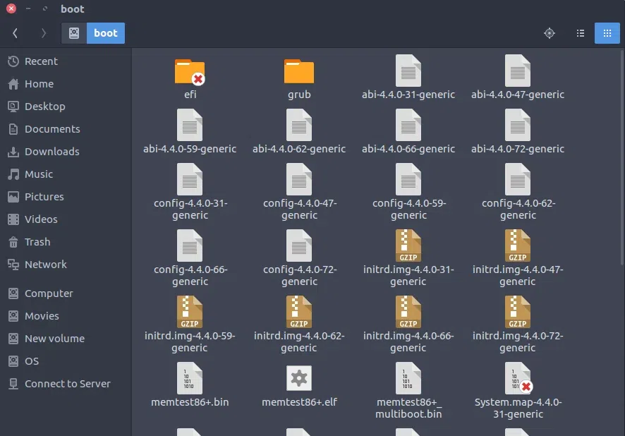

- Chứa các file khởi động, bao gồm nhân Linux (vmlinuz), cùng với các file khác cần thiết cho quá trình khởi động.

### 4. /dev:

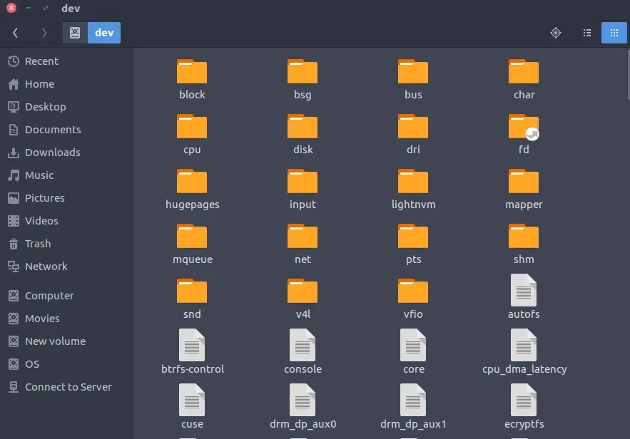

- Các file thiết bị - nơi lưu trữ các phân vùng ổ cứng, thiết bị ngoại vi như usb, ổ đĩa cắm ngoài hay bất cứ thiết bị nào khác. Các file thiết bị này không phải là file thực sự mà là các liên kết tới thiết bị vật lý.

### 5. /etc:

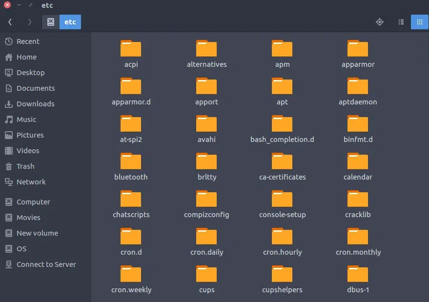

- Chứa các file cấu hình hệ thống cần thiết cho chương trình, cùng với script khởi động và tắt các chương trình.

### 6. /home:

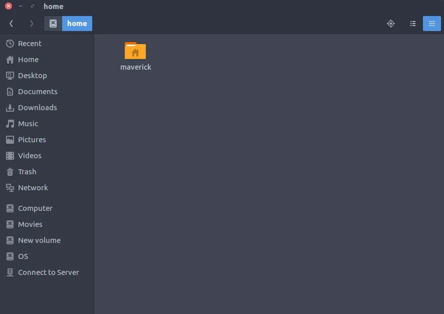

- Chứa các thư mục home của người dùng, nơi lưu trữ các file cá nhân và cài đặt.

### 7. /lib:

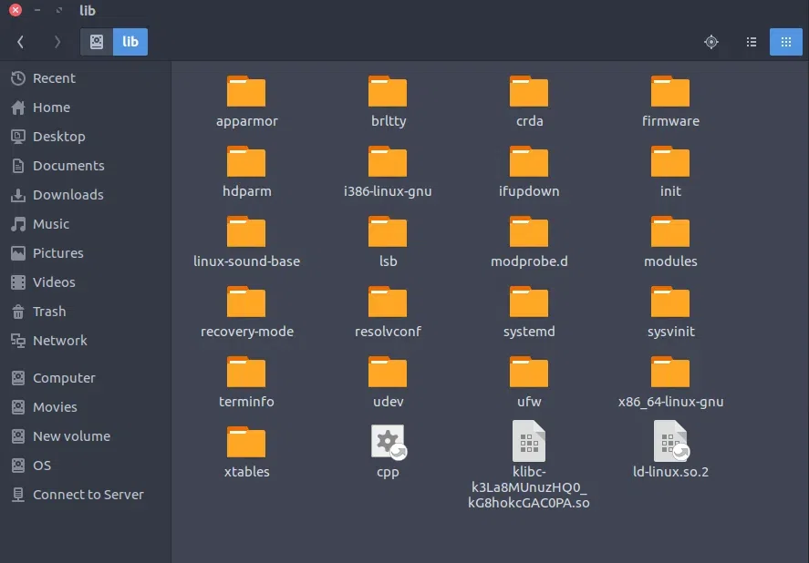

- Thư mục này chứa các thư viện chia sẻ cần thiết cho các chương trình trong /bin và /sbin.

### 8. /media:

- Thư mục /media chứa các thư mục con nơi các thiết bị phương tiện di động được chèn vào máy tính được gắn kết. Ví dụ: khi bạn chèn CD vào hệ thống Linux, một thư mục sẽ tự động được tạo bên trong thư mục /media. Bạn có thể truy cập nội dung của đĩa CD trong thư mục này

### 9. /mnt:

- Chứa các thư mục dùng để system admin thực hiện quá trình mount. Như đã nói, hệ điều hành Linux coi tất cả là các file và lưu giữ trên một cây chung. Đây chính nơi tạo ra các thư mục để 'gắn' các phân vùng ổ đĩa cứng cũng như các thiết bị khác vào. Sau khi được mount vào đây, các thiết bị hay ổ cứng được truy cập từ đây như là một thư mục.

### 10. /opt:

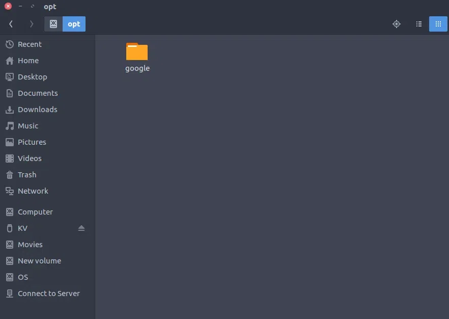

- Tên thư mục này nghĩa là optional (tùy chọn), nó chứa các ứng dụng thêm vào từ các nhà cung cấp độc lập khác. Các ứng dụng này có thể được cài ở /opt hoặc một thư mục con của /opt

### 11. /sbin:

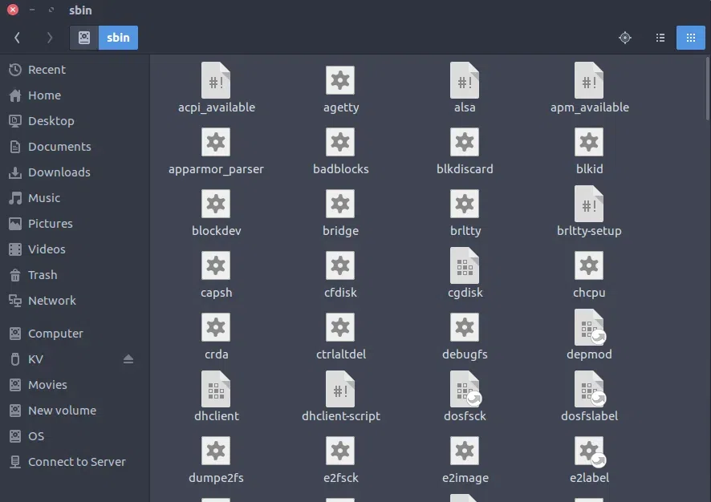

- Chứa các file thực thi hệ thống thiết yếu mà chỉ có người quản trị sử dụng, dùng cho việc bảo trì hệ thống.

### 12. /srv:

- Thư mục /srv chứa dữ liệu của các dịch vụ được cung cấp bởi hệ thống. Nếu bạn đang sử dụng máy chủ HTTP Apache để phục vụ một trang web, bạn có thể lưu trữ các trang web của bạn trong một thư mục trong thư mục /srv.

### 13. /tmp:

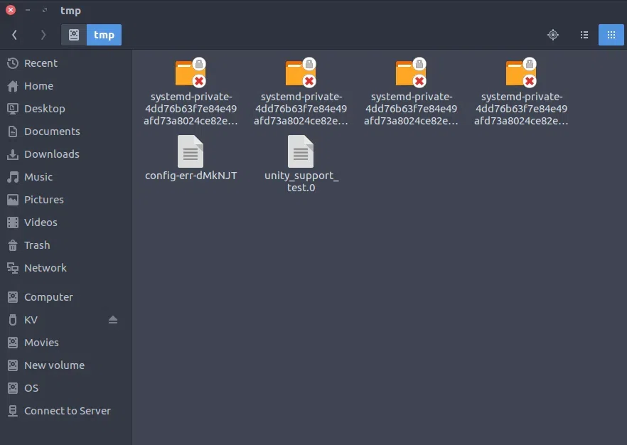

- Thư mục lưu trữ các file tạm của hệ thống và các user. Các file lưu tại đây sẽ bị xóa khi hệ thống khởi động lại.

### 14. /usr:

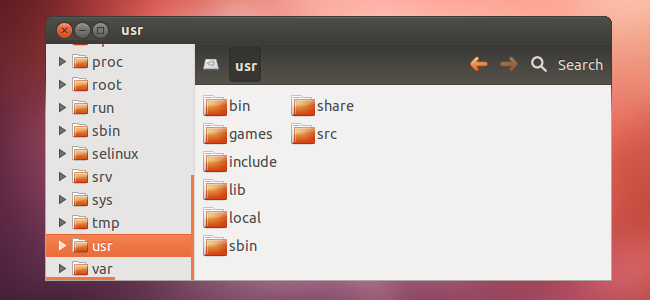

Chứa các file binary, library, tài liệu, source-code cho các chương trình.

- /usr/bin chứa các file thực thi cho chương trình người dùng, trong khi /usr/sbin dành cho các chương trình quản trị.
- /usr/lib chứa thư viện cho /usr/bin và /usr/sbin.
- /usr/local cho các chương trình được cài đặt từ mã nguồn, và /usr/src chứa mã nguồn và tài liệu kernel Linux.

### 15. /proc:

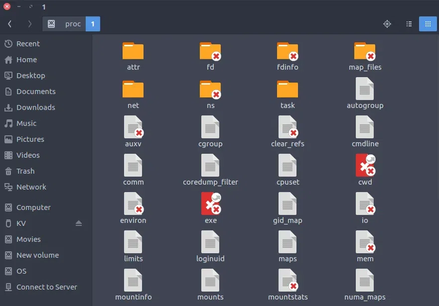

- Chứa đựng thông tin về quá trình xử lý của hệ thống. Đây là một pseudo filesystem chứa đựng các thông tin về các process đang chạy. Đây là một virtual filesystem chứa đựng các thông tin tài nguyên hệ thống. Ví dụ: /proc/cpuinfo cung cấp cho ta thông số kỹ thuật của CPU. Để xem dùng lệnh cat: $cat /proc/cpuinfo

### 16. /var:

- Thư mục /var là đối tác có thể ghi đối với thư mục /usr, phải ở chế độ chỉ đọc trong hoạt động bình thường. Các tệp nhật ký và mọi thứ khác thường được ghi vào /usr trong khi hoạt động bình thường được ghi vào thư mục /var. Ví dụ: bạn sẽ tìm thấy các tệp nhật ký trong /var/log.

## 2.2. Các loại file trong Linux

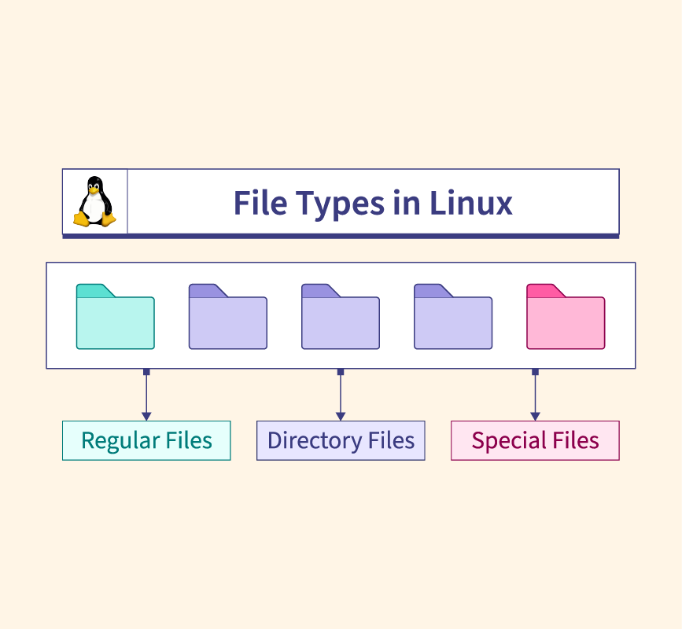

Có 3 loại file trong Linux:

- **Regular file**: Là file thông thường, chứa dữ liệu. Có thể là file text, file ảnh, file âm thanh, ...
- **Directory file**: Là file chứa thông tin về các file và thư mục con. Ví dụ: `/home`, `/etc`, ...
- **Special file**: Là file đặc biệt, đại diện cho các thiết bị phần cứng. Ví dụ: `/dev/sda`, `/dev/tty1`, ...

# 3. Ưu điểm và nhược điểm của Linux

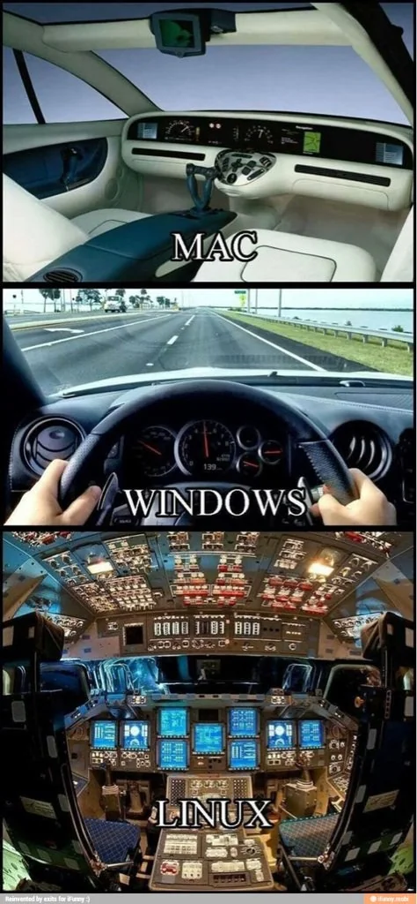

## 3.1. Ưu điểm

- **Miễn phí**: Linux là một hệ điều hành mã nguồn mở, miễn phí, không cần phải trả bất kỳ chi phí nào.
- **Mã nguồn mở**: Mã nguồn của Linux có thể được sửa đổi, phân phối mà không cần phải báo cáo hay trả bất kỳ chi phí nào.
- **Đa nhiệm, đa người dùng**: Linux hỗ trợ nhiều người dùng cùng lúc, mỗi người dùng có thể thực hiện nhiều công việc cùng lúc.
- **Bảo mật cao**: Linux có nhiều cơ chế bảo mật, giúp người dùng bảo vệ dữ liệu cá nhân.
- **Ổn định**: Linux rất ổn định, ít gặp lỗi hệ thống.
- **Hỗ trợ cộng đồng lớn**: Linux có cộng đồng lớn, giúp người dùng giải quyết các vấn đề một cách nhanh chóng.

## 3.2. Nhược điểm

- **Khó sử dụng**: Linux khá khó sử dụng, đặc biệt với người mới bắt đầu.
- **Hạn chế về ứng dụng**: Linux không hỗ trợ nhiều ứng dụng phổ biến như Windows. Một số ứng dụng phổ biến như Photoshop, Microsoft Office không có phiên bản cho Linux.

# 4. Linux Commands

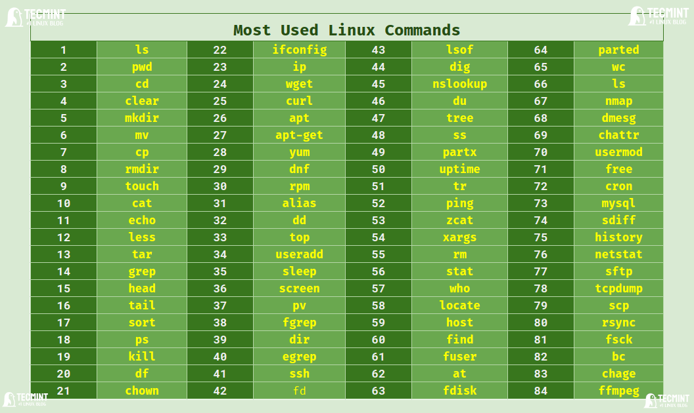

Linux command là các lệnh được nhập vào terminal hoặc console để thực hiện các tác vụ trong Linux. Một số lệnh cơ bản trong Linux:

- **ls**: Liệt kê các file và thư mục trong thư mục hiện tại.
- **cd**: Di chuyển đến thư mục khác.
- **pwd**: Hiển thị đường dẫn đến thư mục hiện tại.
- **mkdir**: Tạo thư mục mới.
- **rm**: Xóa file hoặc thư mục.
- **cp**: Sao chép file hoặc thư mục.
- **mv**: Di chuyển hoặc đổi tên file hoặc thư mục.
- **cat**: Hiển thị nội dung của file.

# 5. Các loại user trong Linux

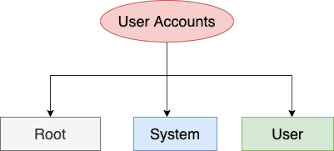

Trong Linux, có 3 loại user là `root`, `system user` và `normal user`.

## 5.1. Root user

Root user là user có quyền cao nhất trong hệ thống, có thể thực hiện mọi tác vụ trong hệ thống. Root user có thể thực hiện các tác vụ như cài đặt phần mềm, cấu hình hệ thống, xóa file hệ thống, ...

## 5.2. System user

System users là các tài khoản được tạo để quản lý và chạy các dịch vụ hệ thống nhất định, chẳng hạn như dịch vụ web, cơ sở dữ liệu, hoặc các tiến trình nền. Những tài khoản này thường có quyền hạn hạn chế và chỉ được phép tương tác với các tệp và thư mục cần thiết cho hoạt động của dịch vụ đó.

## 5.3. Normal user

Normal user là tài khoản cho người dùng bình thường, với các quyền hạn được giới hạn để không ảnh hưởng đến các tài khoản hoặc dịch vụ khác trên hệ thống. Tài khoản này thường được sử dụng cho các hoạt động hàng ngày như duyệt web, soạn thảo văn bản, phát triển phần mềm, v.v.

# 6. Distro linux là gì ? Phân loại các distro Linux

## 6.1. Cấu trúc của Linux.

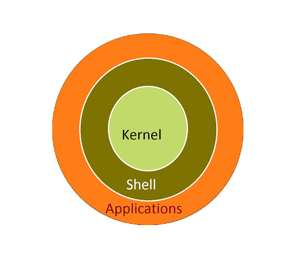

- **Kernel**: Là phần quan trọng nhất của hệ điều hành, quản lý tài nguyên phần cứng và cung cấp các dịch vụ cơ bản cho các chương trình. Kernel Linux được phát triển bởi Linus Torvalds.
- **Shell**: Là một chương trình dịch lệnh, giúp người dùng tương tác với hệ thống. Shell có thể thực thi các lệnh từ người dùng hoặc từ các tập tin lệnh. Một số shell phổ biến trong Linux là `bash`, `zsh`, `sh`, ...
- **Applications**: Là các ứng dụng chạy trên hệ thống, giúp người dùng thực hiện các tác vụ cụ thể. Một số ứng dụng phổ biến trong Linux là `Firefox`, `LibreOffice`, `GIMP`, ...

## 6.2. Distro Linux

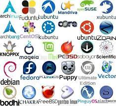

Distro Linux (Linux Distribution) là một bản phân phối của hệ điều hành Linux, bao gồm kernel Linux, shell và các ứng dụng cần thiết. Mỗi distro sẽ được cấu hình và tối ưu cho một mục đích cụ thể, chẳng hạn như máy chủ, máy tính cá nhân, máy tính xách tay, ... Một số distro Linux phổ biến: `Ubuntu`, `Debian`, `CentOS`, `Fedora`, `Kali Linux`, ...

## 6.3. Phân loại các distro Linux

Distro Linux có thể được phân loại dựa trên mục đích sử dụng, cách cài đặt, cách quản lý gói, ... Nhưng ở đây, chúng ta sẽ phân loại các distro Linux dựa trên mục đích sử dụng:

- **Desktop distro**: Là các distro được thiết kế cho máy tính cá nhân, với giao diện đồ họa dễ sử dụng. Một số distro phổ biến: `Ubuntu`, `Fedora`, `Linux Mint`, ...
- **Server distro**: Là các distro được thiết kế cho máy chủ, với các tính năng bảo mật, ổn định và hiệu suất cao. Một số distro phổ biến: `CentOS`, `Debian`, `Ubuntu Server`, ...
- **Security distro**: Là các distro được thiết kế cho mục đích bảo mật, kiểm tra và phân tích bảo mật. Một số distro phổ biến: `Kali Linux`, `Parrot Security OS`, ...
- **Lightweight distro**: Là các distro nhẹ, dành cho máy tính cấu hình thấp. Một số distro phổ biến: `Lubuntu`, `Puppy Linux`, `Bodhi Linux`, ...

# Tài liệu tham khảo

- Source Linux: https://github.com/torvalds/linux
- https://www.geeksforgeeks.org/linux-file-hierarchy-structure/
- https://linuxteamvietnam.us/giai-thich-cau-truc-thu-muc-cua-he-dieu-hanh-linux/
- Danh sách các distro Linux: https://distrowatch.com/
- https://hostingviet.vn/distro-linux-la-gi
- https://www.quora.com/Is-macOS-essentially-built-on-top-of-Linux
- https://refspecs.linuxfoundation.org/fhs.shtml

