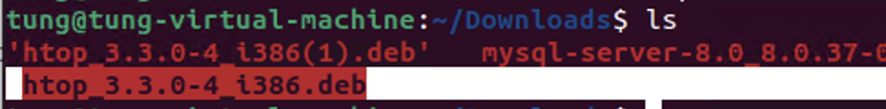
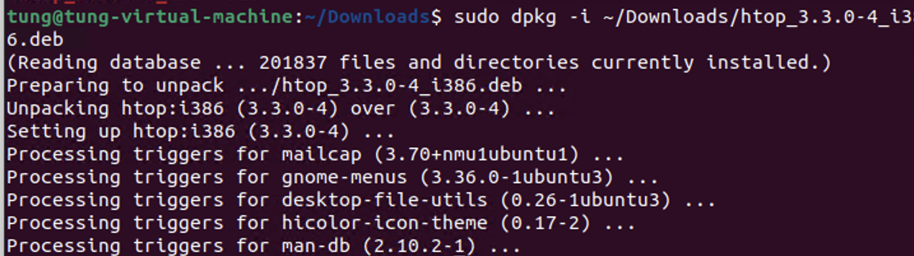

<!-- Tìm hiểu cách cài đặt gói trong Linux:

CentOS:
Tìm hiểu các lệnh yum , dnf để cài đặt gói tự động
Cài đặt bằng các gói bằng các file .rpm
Ubuntu:
Tìm hiểu các lệnh apt để cài đặt gói tự động
Cài đặt bằng các gói .deb
Tìm hiểu cách cài đặt gói offline: -->

# Tìm hiểu cách cài đặt gói trong Linux

## CentOS

### Cài đặt gói bằng yum và dnf

- **Yum** là trình quản lý gói mặc định trên CentOS 6 và các phiên bản cũ hơn. Còn **dnf** là trình quản lý gói mặc định trên CentOS 7 và các phiên bản mới hơn. Cả hai đều hỗ trợ cài đặt gói tự động. Ví dụ:

  ```
  yum install httpd
  dnf install httpd
  ```

- Các câu lệnh cơ bản của yum và dnf:

  ```
  yum install <package_name>: Cài đặt gói
  yum remove <package_name>: Gỡ cài đặt gói
  yum update <package_name>: Cập nhật gói
  yum search <package_name>: Tìm kiếm gói
  yum list installed: Liệt kê các gói đã cài đặt
  ```

- **Cài đặt bằng file .rpm**: Sử dụng lệnh `rpm` để cài đặt gói từ file .rpm. Ví dụ:

  ```
  rpm -ivh httpd.rpm
  ```

  .rpm được cài đặt sẽ được lưu trong thư mục `/var/cache/yum/`. Để xem các gói đã cài đặt, sử dụng lệnh `rpm -qa`. Để gỡ cài đặt gói, sử dụng lệnh `rpm -e <package_name>`.

## Ubuntu

### Cài đặt gói bằng apt

- **Apt** là trình quản lý gói mặc định trên Ubuntu. Ví dụ:

  ```
  apt install apache2
  ```

- Các câu lệnh cơ bản của apt:

  ```
    apt install <package_name>: Cài đặt gói
    apt remove <package_name>: Gỡ cài đặt gói
    apt update: Cập nhật danh sách gói
    apt upgrade: Cập nhật gói
    apt search <package_name>: Tìm kiếm gói
    apt list --installed: Liệt kê các gói đã cài đặt
  ```

- **Cài đặt bằng file .deb**: Sử dụng lệnh `dpkg` để cài đặt gói từ file .deb. Ví dụ:

  ```
  dpkg -i apache2.deb
  ```

  .deb được cài đặt sẽ được lưu trong thư mục `/var/cache/apt/archives/`. Để xem các gói đã cài đặt, sử dụng lệnh `dpkg -l`. Để gỡ cài đặt gói, sử dụng lệnh `dpkg -r <package_name>`.

## Cài đặt gói offline

- Để cài đặt gói offline, bạn cần tải gói cần cài đặt và tất cả các gói phụ thuộc từ một máy có kết nối internet, sau đó chuyển sang máy không có kết nối internet và cài đặt từ các file gói đã tải về. Các bước thực hiện:

  1. Tải gói có định dạng .rpm hoặc .deb từ trang chủ của gói hoặc từ các kho lưu trữ. Ví dụ: https://packages.debian.org/sid/i386/htop/download (gói .deb của htop)

  

  2. Chuyển các file gói đã tải về sang máy không có kết nối internet (tắt kết nối internet)

  

  3. Cài đặt gói từ các file gói đã tải về bằng lệnh `dpkg`. Ví dụ:

  ```
   sudo dpkg -i /path/to/package.deb
  ```
  

## Tài liệu tham khảo

- https://hoang13.wordpress.com/2009/06/06/cai-d%E1%BA%B7t-ph%E1%BA%A7n-m%E1%BB%81m-offline-tren-ubuntu/
- https://www.tecmint.com/install-local-deb-packages-in-debian-ubuntu/