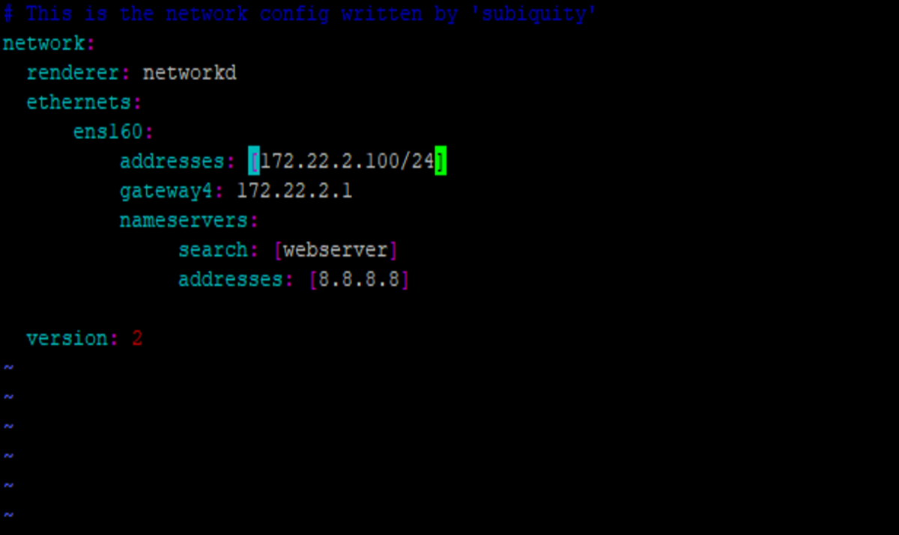
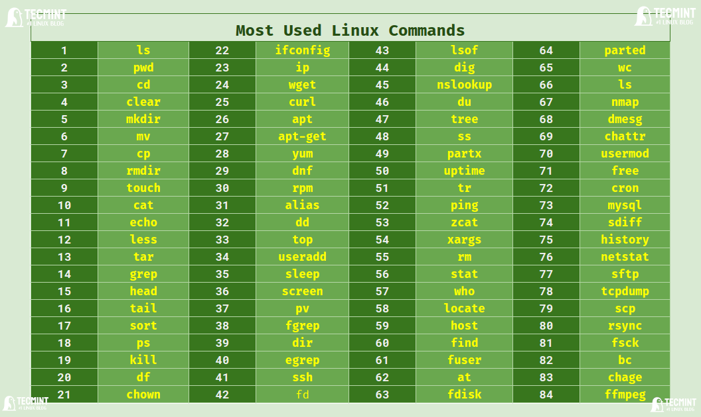

# Tìm hiểu về user và group trong Linux

## 1. User 

- User (người dùng): Mỗi user trên Linux được xác định bằng tên người dùng (username) và ID người dùng (UID). User có thể là người dùng thực sự hoặc là user hệ thống phục vụ các dịch vụ. Mỗi user có một thư mục home riêng, nơi mà user có thể lưu trữ dữ liệu cá nhân và cài đặt cá nhân.
- Một số lệnh thường sử dụng để quản lý user:
  - `useradd`: Tạo mới một user
  - `userdel`: Xóa một user
  - `usermod`: Sửa thông tin user
  - `passwd`: Đặt mật khẩu cho user
  - `su`: Chuyển đổi user
  - `sudo`: Thực thi lệnh với quyền root
- File cấu hình user:
  - `/etc/passwd`: Chứa thông tin về user
  - `/etc/shadow`: Chứa mật khẩu của user

## 2. Group

- Group (nhóm): Nhóm trong Linux được xác định bằng tên nhóm (groupname) và ID nhóm (GID). Mỗi user có thể thuộc về một hoặc nhiều group. Các quyền truy cập được phân chia dựa trên user và group.
- Một số lệnh thường sử dụng để quản lý group:
  - `groupadd`: Tạo mới một group
  - `groupdel`: Xóa một group
  - `groupmod`: Sửa thông tin group
- File cấu hình group:
  - `/etc/group`: Chứa thông tin về group

## 3. Quản lý user và group

- Để thêm một user vào một group, sử dụng lệnh `usermod`:
  ```
  usermod -aG groupname username
  ```
- Để xem thông tin về user và group, sử dụng lệnh `id`:
  ```
    id username
    id groupname
    ```
- Để xem danh sách user và group, sử dụng lệnh `cat`:
    ```
        cat /etc/passwd
        cat /etc/group
    ```
- Để xem user thuộc group nào, sử dụng lệnh `groups`:
    ```
        groups username
    ```
- Để xem thông tin về user, sử dụng lệnh `finger`:
    ```
        finger username
    ```

# Cách cài đặt IP tĩnh trên Linux

## 1. Cài đặt IP tĩnh bằng cấu hình file

- Đối với Ubuntu, cấu hình IP tĩnh thông qua file `/etc/netplan/00-installer-config.yaml`:
- Tương tự, đối với CentOS, cấu hình IP tĩnh thông qua file `/etc/sysconfig/network-scripts/ifcfg-eth0`:



- Các thông số cần cấu hình:
  - `addresses`: Địa chỉ IP và subnet mask
  - `gateway4`: Gateway mặc định
  - `nameservers`: DNS server
  - `optional`: Các thông số khác như `routes`, `dhcp4`,...

- Sau khi cấu hình xong, áp dụng cấu hình bằng lệnh:
  ```
    sudo netplan apply
    ```
## 2. Cài đặt IP tĩnh bằng lệnh

- Sử dụng lệnh `ip` để cấu hình IP tĩnh:
  ```
    sudo ip addr add
    sudo ip route add default via
    sudo echo "nameserver" > /etc/resolv.conf
    ```
- Lệnh `ip` cung cấp nhiều tùy chọn để cấu hình IP, subnet mask, gateway, DNS, route,...

# Thực hiện tìm hiểu 1 số lệnh thao tác cơ bản với linux: ls, cd, pwd, mkdir, …



- `ls`: Liệt kê danh sách các file và thư mục trong thư mục hiện tại
- `cd`: Di chuyển đến một thư mục khác
- `pwd`: Hiển thị đường dẫn đến thư mục hiện tại
- `mkdir`: Tạo một thư mục mới
- `rmdir`: Xóa một thư mục
- `cp`: Sao chép file hoặc thư mục
- `mv`: Di chuyển hoặc đổi tên file hoặc thư mục
- `rm`: Xóa file hoặc thư mục

# Giấy phép nguồn mở: GPL, MIT, Apache, BSD

- Giấy phép nguồn mở (open source license) là các điều khoản pháp lý cho phép người dùng được tự do sử dụng, sửa đổi và phân phối phần mềm nguồn mở.

## 1. GPL (General Public License)

- GPL là một giấy phép nguồn mở phổ biến nhất, được sử dụng cho nhiều dự án phần mềm nguồn mở. 
- Điều quan trọng nhất của GPL là việc bảo vệ quyền tự do của người dùng, đảm bảo rằng phần mềm nguồn mở sẽ luôn miễn phí và mã nguồn mở.

## 2. MIT License

- MIT License là một giấy phép nguồn mở đơn giản và linh hoạt, cho phép người dùng sử dụng, sửa đổi và phân phối mã nguồn mở mà không cần phải đóng gói mã nguồn mở của họ dưới cùng một giấy phép.

## 3. Apache License

- Apache License là một giấy phép nguồn mở được sử dụng rộng rãi cho các dự án phần mềm nguồn mở. 
- Apache License bảo vệ quyền sở hữu trí tuệ của tác giả và đồng thời cho phép người dùng sử dụng, sửa đổi và phân phối mã nguồn mở.

## 4. BSD License

- BSD License là một giấy phép nguồn mở linh hoạt, cho phép người dùng sử dụng, sửa đổi và phân phối mã nguồn mở mà không cần phải đóng gói mã nguồn mở của họ dưới cùng một giấy phép.

# Tài liệu tham khảo

- [Linux User and Group Management](https://www.tecmint.com/linux-user-and-group-management/)
- [How to Set Static IP Address in Ubuntu 20.04](https://linuxize.com/post/how-to-configure-static-ip-address-on-ubuntu-20-04/)
- [Linux Commands Cheat Sheet](https://www.linuxtrainingacademy.com/linux-commands-cheat-sheet/)
- [Open Source Licenses Explained](https://opensource.org/licenses)
```