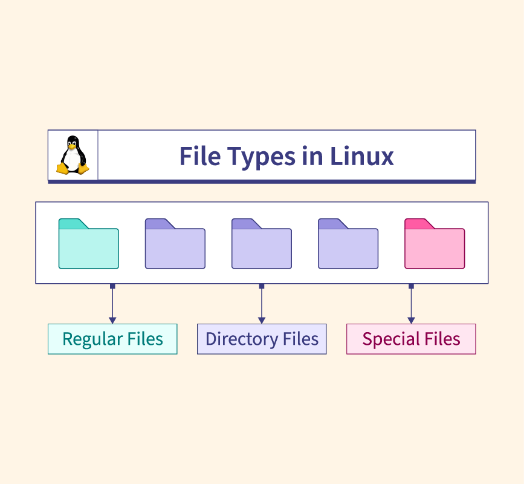
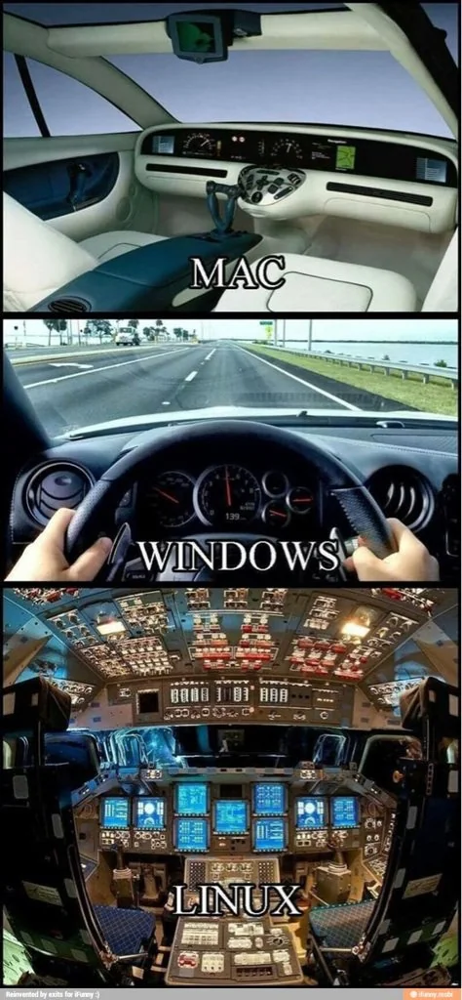
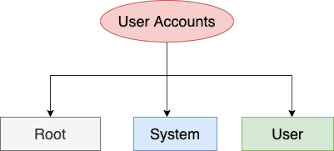
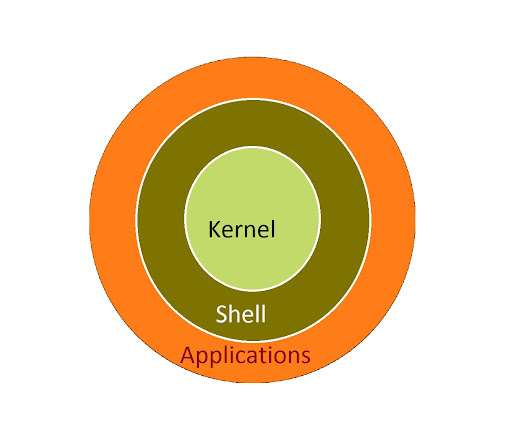
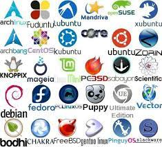

# 1. Linux là gì?

Linux là một hệ điều hành mã nguồn mở, được phát triển dựa trên Unix. Linux được phát triển bởi Linus Torvalds vào năm 1991. Linux là một hệ điều hành đa nhiệm, đa người dùng và đa nhiệm. Linux là một hệ điều hành miễn phí, có thể sử dụng, sao chép, phân phối và sửa đổi mã nguồn mà không cần phải trả bất kỳ chi phí nào.

# 2. Cấu trúc file. thư mục trong Linux

Linux sử dụng cấu trúc thư mục hệ thống tệp. Cấu trúc thư mục hệ thống tệp Linux bắt đầu từ thư mục gốc (`/`). Một số thư mục quan trọng trong Linux:

- **/**: Root directory, là thư mục gốc của hệ thống.
- **/bin**: Chứa các file thực thi cho việc khởi động hệ thống và các ứng dụng cơ bản.
- **/etc**: Chứa các file cấu hình của hệ thống.
- **/home**: Chứa các thư mục cá nhân của người dùng.
- **/usr**: Chứa các ứng dụng và file của người dùng.
- **/var**: Chứa dữ liệu biến đổi như log files.
- **/tmp**: Thư mục cho các file tạm thời.

Có 3 loại file trong Linux:

- **Regular file**: Là file thông thường, chứa dữ liệu. Có thể là file text, file ảnh, file âm thanh, ...
- **Directory file**: Là file chứa thông tin về các file và thư mục con. Ví dụ: `/home`, `/etc`, ...
- **Special file**: Là file đặc biệt, đại diện cho các thiết bị phần cứng. Ví dụ: `/dev/sda`, `/dev/tty1`, ...

# 3. Ưu điểm và nhược điểm của Linux

## 3.1. Ưu điểm

- **Miễn phí**: Linux là một hệ điều hành mã nguồn mở, miễn phí, không cần phải trả bất kỳ chi phí nào.
- **Mã nguồn mở**: Mã nguồn của Linux có thể được sửa đổi, phân phối mà không cần phải báo cáo hay trả bất kỳ chi phí nào.
- **Đa nhiệm, đa người dùng**: Linux hỗ trợ nhiều người dùng cùng lúc, mỗi người dùng có thể thực hiện nhiều công việc cùng lúc.
- **Bảo mật cao**: Linux có nhiều cơ chế bảo mật, giúp người dùng bảo vệ dữ liệu cá nhân.
- **Ổn định**: Linux rất ổn định, ít gặp lỗi hệ thống.
- **Hỗ trợ cộng đồng lớn**: Linux có cộng đồng lớn, giúp người dùng giải quyết các vấn đề một cách nhanh chóng.

## 3.2. Nhược điểm

- **Khó sử dụng**: Linux khá khó sử dụng, đặc biệt với người mới bắt đầu.
- **Hạn chế về ứng dụng**: Linux không hỗ trợ nhiều ứng dụng phổ biến như Windows. Một số ứng dụng phổ biến như Photoshop, Microsoft Office không có phiên bản cho Linux.

# 4. Linux Commands

Linux command là các lệnh được nhập vào terminal hoặc console để thực hiện các tác vụ trong Linux. Một số lệnh cơ bản trong Linux:

- **ls**: Liệt kê các file và thư mục trong thư mục hiện tại.
- **cd**: Di chuyển đến thư mục khác.
- **pwd**: Hiển thị đường dẫn đến thư mục hiện tại.
- **mkdir**: Tạo thư mục mới.
- **rm**: Xóa file hoặc thư mục.
- **cp**: Sao chép file hoặc thư mục.
- **mv**: Di chuyển hoặc đổi tên file hoặc thư mục.
- **cat**: Hiển thị nội dung của file.

# 5. Các loại user trong Linux

Trong Linux, có 3 loại user là `root`, `system user` và `normal user`.

## 5.1. Root user

Root user là user có quyền cao nhất trong hệ thống, có thể thực hiện mọi tác vụ trong hệ thống. Root user có thể thực hiện các tác vụ như cài đặt phần mềm, cấu hình hệ thống, xóa file hệ thống, ...

## 5.2. System user

System users là các tài khoản được tạo để quản lý và chạy các dịch vụ hệ thống nhất định, chẳng hạn như dịch vụ web, cơ sở dữ liệu, hoặc các tiến trình nền. Những tài khoản này thường có quyền hạn hạn chế và chỉ được phép tương tác với các tệp và thư mục cần thiết cho hoạt động của dịch vụ đó.

## 5.3. Normal user

Normal user là tài khoản cho người dùng bình thường, với các quyền hạn được giới hạn để không ảnh hưởng đến các tài khoản hoặc dịch vụ khác trên hệ thống. Tài khoản này thường được sử dụng cho các hoạt động hàng ngày như duyệt web, soạn thảo văn bản, phát triển phần mềm, v.v.

# 6. Distro linux là gì ? Phân loại các distro Linux

## 6.1. Cấu trúc của Linux.

- **Kernel**: Là phần quan trọng nhất của hệ điều hành, quản lý tài nguyên phần cứng và cung cấp các dịch vụ cơ bản cho các chương trình. Kernel Linux được phát triển bởi Linus Torvalds. 
- **Shell**: Là một chương trình dịch lệnh, giúp người dùng tương tác với hệ thống. Shell có thể thực thi các lệnh từ người dùng hoặc từ các tập tin lệnh. Một số shell phổ biến trong Linux là `bash`, `zsh`, `sh`, ...
- **Applications**: Là các ứng dụng chạy trên hệ thống, giúp người dùng thực hiện các tác vụ cụ thể. Một số ứng dụng phổ biến trong Linux là `Firefox`, `LibreOffice`, `GIMP`, ...

## 6.2. Distro Linux

Distro Linux (Linux Distribution) là một bản phân phối của hệ điều hành Linux, bao gồm kernel Linux, shell và các ứng dụng cần thiết. Mỗi distro sẽ được cấu hình và tối ưu cho một mục đích cụ thể, chẳng hạn như máy chủ, máy tính cá nhân, máy tính xách tay, ... Một số distro Linux phổ biến: `Ubuntu`, `Debian`, `CentOS`, `Fedora`, `Kali Linux`, ...

## 6.3. Phân loại các distro Linux

Distro Linux có thể được phân loại dựa trên mục đích sử dụng, cách cài đặt, cách quản lý gói, ... Nhưng ở đây, chúng ta sẽ phân loại các distro Linux dựa trên mục đích sử dụng:

- **Desktop distro**: Là các distro được thiết kế cho máy tính cá nhân, với giao diện đồ họa dễ sử dụng. Một số distro phổ biến: `Ubuntu`, `Fedora`, `Linux Mint`, ...
- **Server distro**: Là các distro được thiết kế cho máy chủ, với các tính năng bảo mật, ổn định và hiệu suất cao. Một số distro phổ biến: `CentOS`, `Debian`, `Ubuntu Server`, ...
- **Security distro**: Là các distro được thiết kế cho mục đích bảo mật, kiểm tra và phân tích bảo mật. Một số distro phổ biến: `Kali Linux`, `Parrot Security OS`, ...
- **Lightweight distro**: Là các distro nhẹ, dành cho máy tính cấu hình thấp. Một số distro phổ biến: `Lubuntu`, `Puppy Linux`, `Bodhi Linux`, ...

# Tài liệu tham khảo

- Source Linux: https://github.com/torvalds/linux
- Danh sách các distro Linux: https://distrowatch.com/
- https://hostingviet.vn/distro-linux-la-gi

