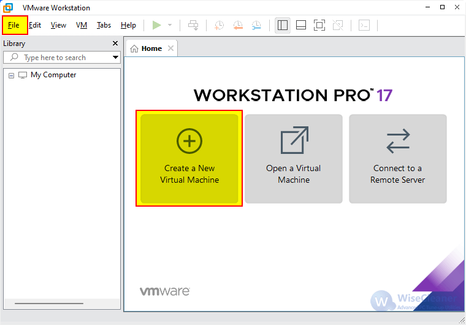
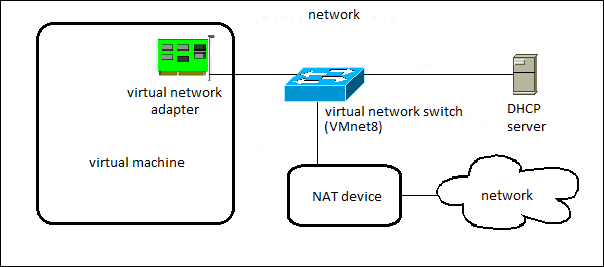
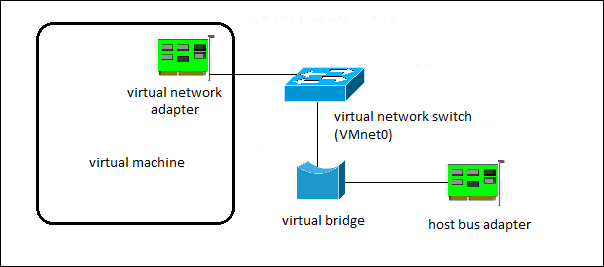
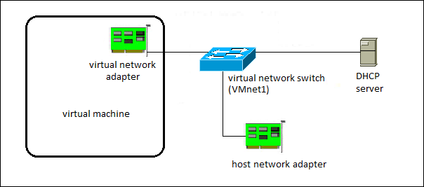
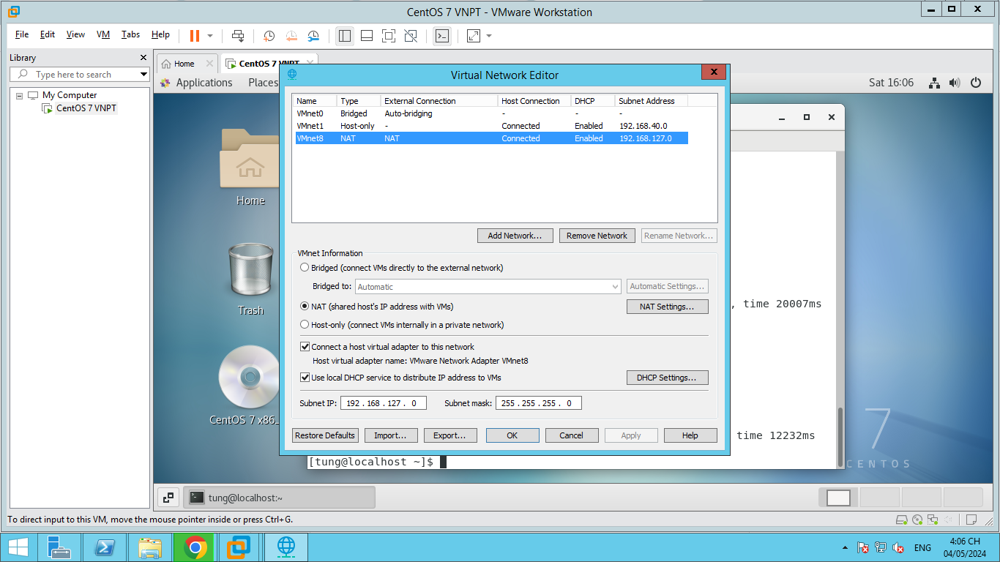

# 1. Cách cài đặt VMWare Workstation Pro 17

- Bước 1: Truy cập vào trang chủ của [VMWare Workstation Pro 17](https://www.vmware.com/products/workstation-pro/workstation-pro-evaluation.html) và tải về bản cài đặt phần mềm (có 2 phiên bản là Windows và Linux).
- Bước 2: Mở file cài đặt vừa tải về và chọn `Next` để tiếp tục.

# 2. Cách tạo máy ảo trên VMWare Workstation Pro 17

- Tải file iso cài đặt hệ điều hành từ trang chủ của hệ điều hành đó. Ví dụ: [Ubuntu](https://ubuntu.com/download/desktop).

- Bước 1: Mở VMWare Workstation Pro 17 và chọn `Create a New Virtual Machine`.
- Bước 2: Chọn `Typical` và chọn `Next`.
- Bước 3: Chọn `Installer disc image file (iso)` và chọn `Browse` để chọn file iso cài đặt hệ điều hành.
- Bước 4: Chọn `Next` và nhập thông tin cần thiết cho máy ảo.
- Bước 5: Chọn `Finish` để tạo máy ảo.

# 3. Phân biệt 3 chế độ network trong VMware: NAT, Bridge, Host-only

- **NAT (Network Address Translation)**: Card mạng của máy ảo kết nối với VMnet8, VNnet8 cho phép máy ảo đi ra mạng vật lý bên ngoài internet thông qua cơ chế NAT. Lúc này lớp mạng bên trong máy ảo khác hoàn toàn với lớp mạng của card vật lý bên ngoài, hai mạng hoàn toàn tách biệt. 
- IP của card mạng máy ảo sẽ được cấp bởi DHCP của VMnet8, trong trường hợp bạn muốn thiết lập IP tĩnh cho card mạng máy ảo bạn phải đảm bảo chung lớp mạng với VNnet8 thì máy ảo mới có thể đi internet.

 <b> Hình ảnh minh họa chế độ NAT </b> 

- **Bridge**: Ở chế độ này, card mạng trên máy ảo được gắn vào VMnet0, VMnet0 này liên kết trực tiếp với card mạng vật lý trên máy thật, máy ảo lúc này sẽ kết nối internet thông qua card mạng vật lý và có chung lớp mạng với card mạng vật lý.

 <b> Hình ảnh minh họa chế độ Bridge </b> 

- **Host-only**: Máy ảo được kết nối với VMnet có tính năng Host-only,  là VMnet1. Các máy ảo không có kết nối vào mạng vật lý bên ngoài hay internet thông qua máy thật, có nghĩa là mạng VMnet Host-only và mạng vật lý hoàn toàn tách biệt. IP của máy ảo được cấp bởi DHCP của VMnet tương ứng.

 <b> Hình ảnh minh họa chế độ Host-only </b> 

# 4. Cấu hình chế độ NAT cho máy ảo trên VMWare Workstation Pro 17 để kết nối internet

## 4.1. Cấu hình cho VMnet8

- Bước 1: Chọn `Edit` -> `Virtual Network Editor`.
- Bước 2: Chọn VMnet8
- Bước 3: Chọn NAT và tick vào `Connect a host virtual adapter to this network` + `Use local DHCP service to distribute IP address to VMs` để cấp IP cho máy ảo.
- Bước 5: Chọn `OK` để lưu cấu hình.

## 4.2. Cấu hình cho máy ảo

- Bước 1: Chọn `Edit virtual machine settings`.
- Bước 2: Chọn `Network Adapter` và chọn `NAT`.
- Bước 3: Chọn `OK` để lưu cấu hình.

# 5. Cấu hình chế độ Bridge cho máy ảo trên VMWare Workstation Pro 17 để ping từ máy thật vào máy ảo

## 5.1. Cấu hình cho VMnet0

- Bước 1: Chọn `Edit` -> `Virtual Network Editor`.
- Bước 2: Chọn VMnet0
- Bước 3: Chọn Bridge
- Bước 4: Chọn `OK` để lưu cấu hình.

## 5.2. Cấu hình cho máy ảo

- Bước 1: Chọn `Edit virtual machine settings`.
- Bước 2: Chọn `Network Adapter` và chọn `Bridge`.
- Bước 3: Chọn `OK` để lưu cấu hình.

# 6. Cấu hình chế độ Host-only cho máy ảo trên VMWare Workstation Pro 17 để ping từ máy thật vào máy ảo

## 6.1. Cấu hình cho VMnet1

- Bước 1: Chọn `Edit` -> `Virtual Network Editor`.
- Bước 2: Chọn VMnet1
- Bước 3: Chọn Host-only và tick vào `Connect a host virtual adapter to this network` + `Use local DHCP service to distribute IP address to VMs` để cấp IP cho máy ảo.
- Bước 4: Chọn `OK` để lưu cấu hình.

## 6.2. Cấu hình cho máy ảo

- Bước 1: Chọn `Edit virtual machine settings`.
- Bước 2: Chọn `Network Adapter` và chọn `Host-only`.
- Bước 3: Chọn `OK` để lưu cấu hình.

# Tài liệu tham khảo
- https://dummytip.com/giai-ngo-virtualization-phan-5-3-che-do-vmware-network-configuration-ma-ban-nhat-dinh-phai-biet/